# Hopper the Grasshopper · 3D edition
## Design and production plan

A 3D action game about an enormous insect robot, the small boy on his back, and the freedom of a leap that clears a tower. The player crosses vast painted districts by hopping from structure to structure, fights shadow creatures on rooftops and in the open air, and keeps a far landmark on the horizon that grows closer with every chapter. Falling never hurts; only shadows do.

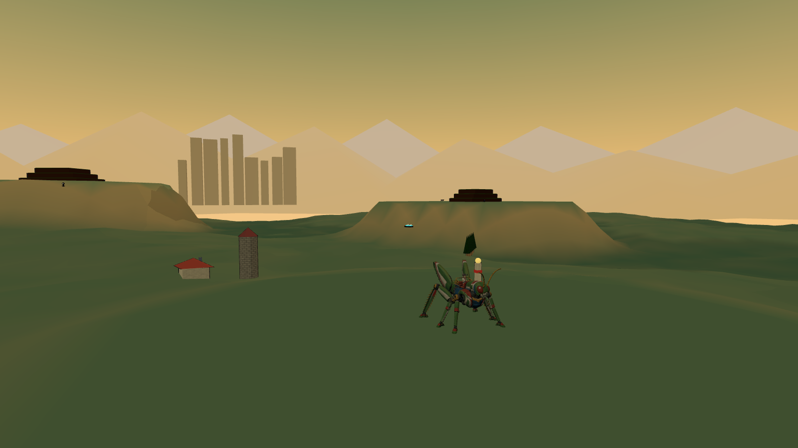

This document reinterprets the shipped 2D game as a 3D game. It keeps the title screen, the three music recordings, the three missions and nine regions with their characters, the eighteen shadow species, the three commanders, and the 1970s cel-and-gouache personality. It changes everything about how the game plays: the 2D rules are not ported. Only ideas that earn a place in three dimensions return, and most of the movement and combat is new.

Three things are already real. The animated Hopper, rider and combined models are delivered in `hopper/models/`. Every other model, texture and sky the design needs has a procedural stand-in in `hopper/3d/standins/`, rendered in the figures of this document, so building can start today and art can arrive in any order. The full asset requests, each with the rigging it needs, are in `model-requests.md` and `image-requests.md`, and `standin-manifest.json` ties every request to its placeholder and its final file.

All numbers are starting points for the first playable, chosen so that the feel described here is reachable on the first day of tuning. The next step is a review of the play direction, the control mapping and the production sequence, then milestone one.

<!-- page -->
## The experience

The first thing the player does is press A and hold it. Hopper's hind legs compress, snap open, and the ground drops away for four and a half seconds. At the top of the arc the fields are a quilt, the farmhouse is a toy, and on the horizon, past the terraces, the ivory towers of Crownline City are visible. Keep holding, and the wings open: Hopper glides, losing height slowly, steering with the stick, for as long as it takes to reach the next terrace, or the silo cap, or the roof of the seed vessel where three hounds are waiting. Land badly and there is no penalty but the climb back. Land on a hound and it dies, and Hopper bounces off it higher than the jump that got him there.

That is the loop: read the space, choose a line, leap, fight whatever is on the way or in the way, land, and leap again. It is played at Hopper's scale, fourteen metres to the head, in districts two and a half kilometres across, with the region's exit standing on the horizon from the moment the region starts.

### Design pillars

- **The leap is the game.** Height, hang time, gliding and air steering are generous. Every roof, mast, crane and reef is reachable, usually by more than one route. The joy is choosing lines.
- **Falling is free. Only shadows hurt.** There are no pits and no fall damage. Every district has a floor, and every low place has a way back up within about twenty seconds. Armour is lost only to enemy attacks. Hazards push, lift and fling; they never damage.
- **Fight on the ground and in the air.** Flyers are steps: stomping one bounces Hopper upward, so an air fight is a chain of bounces, kicks and laser bursts that can keep him aloft. On the ground the fight is about position, cores and timing, and the same buttons.
- **A far thing that gets closer.** Each region shows its exit landmark from its entrance. Chapters bring it nearer; the last chapter reaches it. The player always knows where the story is going because it is on the horizon.
- **The same face.** The same title screen, logo, poster and music; the same Hopper, rider, shadows and commanders; the same painted, hand-inked look, now built from cel-shaded models under painted skies.

### Rhythm and length

| Mission | Regions | Play target |
| --- | --- | --- |
| 1 Earthbound Thunder | Sunseed Fields · Crownline City · Thunderhead Range | 28–34 min + Night Rook 4–5 min |
| 2 The Iron Migration | Cinder Foundries · Tempest Docks · Skyhook Works | 30–36 min + Smelter Leviathan 4–5 min |
| 3 Beyond the Black Sun | Vermilion Basin · Cobalt Drift · Violet Inversion | 32–38 min + Eclipse Regent 5–6 min |

A region is about ten minutes on the main line and longer for anyone who chases signals. Each region is five named chapters, keeping the 2D chapter names, and every chapter is a leg between two landmarks with one dominant beat: learn, run, fight, climb, drop, hazard, vista, rest or finish. The whole campaign is around one hour forty-five minutes, with shorter repeat clears.

<!-- page -->
## What stays and what changes

| Kept from the 2D game | Reinterpreted for 3D |
| --- | --- |
| Title screen: poster, logo, Press Start, play-select with the three episodes | Same components; a 3D rendered poster is optional later |
| Music: the title theme, Grass March through episodes one and two, Dark Moon through episode three | Same routing; effects gain 3D position |
| Three missions, nine regions, forty-five chapter names, three commanders | Regions become open districts with a landmark spine instead of a corridor |
| Eighteen shadow species with their silhouettes, tells and cores | Behaviours rebuilt around rooftops, air lanes and stomp bounces |
| Hopper, the rider, the eye lasers, the hind-leg kick, the stomp | Now a full 3D move set: glide, dive, wall kick, mantle, crouch charge, lock-on |
| Armour pips, checkpoints, signals, caged signals, capsules, spring pads | Spring pads, thermals and wind lanes carry Hopper up rather than across |
| Heavy, low and inverted gravity in the third mission | Gravity volumes in an open space; inversion galleries on arch ceilings |
| 1970s cel character treatment and gouache landscapes | Cel-shaded models with ink outlines under painted equirect skies |
| Xbox-first controls, menus, pause, settings, accessibility rules | Camera controls and 3D readability aids added |

Deliberately not carried over: the directional two-way defence of the 2D game (rear kick only, front guard only), the one-way shelves, ceiling runs as a required mechanic, the fixed side view and its camera rules, and death by falling. Those were answers to a side-scroller's questions. The 3D game asks different ones.

### What the player is doing, minute to minute

1. **Reading the district.** Where is the landmark, which structures lead toward it, where are the shadows perched, where is the way back up if this jump misses.
2. **Choosing a line.** A tap-hop across roof decks, a full leap to a tower ledge, a wall-kick ladder up a corner, a glide off a chimney onto a train, a spring pad into a thermal.
3. **Fighting through it.** Shooting the sniper on the far roof while gliding in; kicking the pouncer that lands beside him; stomping a ray to bounce over the gap; diving onto a nest.
4. **Landing and looking up.** A checkpoint totem lights, the landmark is nearer, the next leg is visible.

<!-- page -->
## Hopper in three dimensions

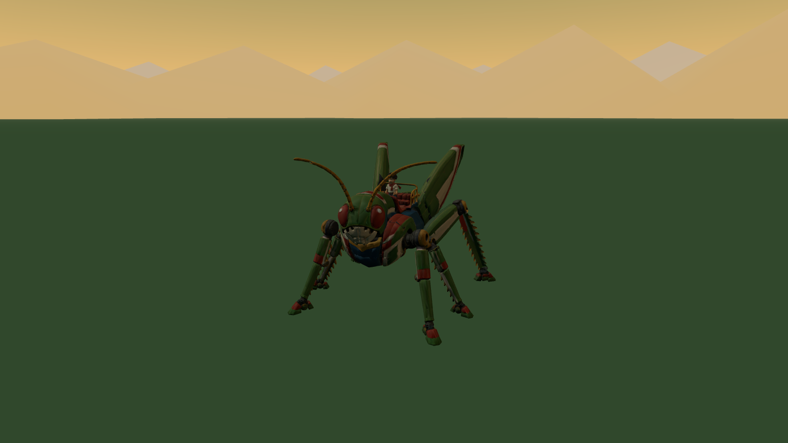

The delivered models set the scale of everything. Hopper is 14 m from his feet to the camera socket on his head, 29 m long from the antennae to the hind feet and 23 m wide across the leg spread. The rider is 5.6 m tall, an artistic fit to the couch rather than a child's height, and is parented under the seat socket in the combined file. Call Hopper's height **H**; the movement numbers below are in metres and in H.

### What the models give the game

- **Rig:** a 51-joint insect skeleton with six legs, two wings and three antenna segments per side, and a 41-joint humanoid rider. Both face +Z, +Y up, metres.
- **Clips:** twenty Hopper actions and five rider reactions, listed in `models/manifest.json` with their event timings. Walk and Run are in place; the jump family is physics-driven.
- **Sockets:** feet, laser origins, shield, camera, centre of mass, rear-kick hitboxes, seat, grips and footrests; on the rider, hands, feet, chest, head, camera and mount.

### Clip mapping

| Game state | Clip | Notes |
| --- | --- | --- |
| Standing, looking | Idle | Rider Riding_Idle layered |
| Moving | Walk → Run by speed | Blend by stick deflection |
| Crouch charge | Crouch → Crouch_Hold | Femurs compress with charge |
| Takeoff | Jump_Start | Rear attack window 0.22–0.6 |
| Airborne | Jump_Loop | Physics owns the arc |
| Glide | Glide_Loop (new) | Wings open over 0.25 s |
| Dive | Dive_Loop (new) | Legs tucked, head down |
| Landing | Land / Stomp_Land (new) | Ground contact event 0.16 |
| Kick | Spin_Kick / Air_Kick (new) | Facing preserved |
| Lasers | Fire_Start → Fire_Loop → Fire_End | Laser sockets aim the bolts |
| Guard | Block_Start → Block_Loop → Block_End | Shield socket anchors the dome |
| Hit, defeat, win | Hit_Reaction, Defeat, Victory | Rider Hit_Reaction, Cheer |

The new clips are request M-001; they add to the existing rig without changing the mesh. Until they arrive the game plays Jump_Loop for gliding with the wing joints opened procedurally, Crouch_Hold for diving and Land for stomps, which is enough to build against.

### The rider

The boy is company and a scale reference, never a health bar. He leans into leaps, braces for stomps, streams his scarf in a glide, points at the landmark during Horizon View and cheers when a knot is cleared. He has no separate hit points and cannot be knocked off.

<!-- page -->
## Controls

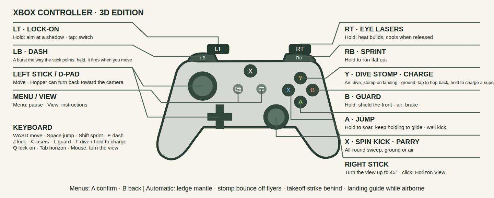

| Xbox | Action | Keyboard and mouse |
| --- | --- | --- |
| Left stick / D-pad | Move, camera-relative; full deflection runs | WASD |
| Right stick | Camera; click to reset behind Hopper | Mouse |
| A | Jump; hold in the air to hover on beating wings, keep holding to glide; at a wall, wall kick | Space |
| X | Spin kick, all-round, ground or air; parries during its first frames | J |
| B | Guard (hold): shield the front; in the air, air brake | L |
| Y | In the air: dive, stomp on landing. On the ground: hop back | F |
| RT | Eye lasers (hold); heat builds and cools | K or left mouse |
| LT | Lock-on (hold); tap to switch target | Q |
| RB | Crouch charge (hold); release for a super leap | Shift |
| LB | Horizon View (hold): frame the far landmark and the next checkpoint | Tab |
| Menu / View | Pause / instructions | Escape / I |

Automatic, with no button: ledge mantle when the front feet reach a lip, stomp bounce when landing on a flyer or an exposed back, the takeoff strike behind Hopper in the first 0.16 s of any jump, and the landing guide projected below him whenever he is airborne. Menus keep the collection's conventions: A confirms, B backs out, any fresh button starts from the idle title screen, the left stick enters utility navigation.

The mapping keeps the 2D game's muscle memory where it still means the same thing (A jump and hover, X kick, B guard, RT lasers, Menu, View) and gives the four unused inputs to the four new 3D verbs. Nothing essential is on a click or a combination.

<!-- page -->
## Movement

The simulation runs at a fixed 120 Hz, as the 2D engine does, with animation timed independently. Gravity is stylised at 120 m/s² in Earth regions, 1.25× that on the way down, far heavier than the real thing so that a jump is a launch and a landing has weight: the same apexes as before in about half the airtime.

| Parameter | Value | Result |
| --- | --- | --- |
| Run speed | 66 m/s (4.7 H/s), 106 sprinting | Crosses a 100 m roof in a second and a half |
| Acceleration, stop, turn | 0.2 s · 0.15 s · the camera's forward | Hopper faces the route; backpedal at 55 %, strafe at 85 % |
| Tap jump | 23 m apex (1.6 H) in 0.6 s, 1.15 s airtime; 108 m running, 162 sprinting; a 0.2 s hold adds a few metres | A quick launch between roof decks |
| Hover | A held in the air: 1.8 s of altitude held on beating wings, refilled on landing | Cross a gap, line up a landing, fight above the ground |
| Takeoff lunge | +24 m/s along the run (or the stick) | The leap goes forward, not merely up |
| Glide | Sink 7 m/s, forward 80 m/s, once the hover is spent | Height becomes distance at eleven to one |
| Crouch charge | 0.8 s to full; super leap to 140 m (10 H), 6.1 s | Reaches a tower roof from the street |
| Spring pad | Launch to 168 m (12 H); hold A to float | The tallest single climb |
| Thermal | Lift 25 m/s inside the column while gliding | Chimneys, furnace doors, vents |
| Wind lane | 15 m/s lateral push, marked by streaks | Bends a glide, never past its landing |
| Stomp bounce | 56 m (4 H); 84 m with A held | Flyers are steps |
| Dive | 2.5× gravity, terminal 190 m/s; 100 m in 1 s | Fast return to the ground, stomp on landing |
| Wall kick | 62 m/s up (16 m), 26 m/s away, unlimited chain | Tower corners are ladders |
| Ledge mantle | Reach 6 m over the lip, 0.7 s | Forgives a short leap |
| Air control | Half of ground acceleration; steering turns the arc, never slows it | Momentum is kept; pushing back still brakes |
| Coyote time, input buffer | 0.12 s · 0.14 s | Forgiving edges and landings |

### The jump family

A tap is a leap, not a hop: takeoff adds a forward lunge along the way Hopper is already running, and the air steering redirects that speed without bleeding it, so a jump goes four to seven times further than it goes up. A short hold after takeoff adds a few metres, no more. Holding A in the air is a **hover**: the wings beat hard, the fall stops, and Hopper holds his height for just under two seconds, long enough to cross a gap, pick a landing or trade shots with a flyer. There is no second jump and no boost; the hover is a pause in the air, not a climb. When the hover is spent and A is still held, the wings lock open into a glide that lasts until Hopper lands, presses Y to dive, or releases A to drop. Releasing and pressing A again while falling hovers again if any fuel is left; the fuel refills on the ground. Steering in the air is strong enough to correct a line, never so strong that arcs stop reading.

Hopper always faces forward: along the trail, or wherever the camera's 45° of manual turn points, or at a locked target. Pulling the stick back is a backpedal at half speed, sideways is a strafe, and the dash, the hop back and the wall kick are manoeuvres that keep the facing. Turning round is the camera's job, never the stick's, so the rider is always looking where the danger is.

The crouch charge is the deliberate big jump. Holding RB compresses the hind legs over 0.8 s; releasing launches straight up by charge, and the stick during the charge sets the direction. It is slow to start and enormous, so it is the way onto the tall things and rarely a combat move.

Wall kicks chain without limit, because the world is full of corners and the ladder up a tower is a rhythm the player should be allowed to enjoy. Each kick preserves facing and commits steering for 0.16 s.

### The trail

Every district is a trail: a smooth route from the start totem through each checkpoint to the exit, authored as waypoints so that it winds between the structures, climbs the terraces and plateaus, drops through the valleys and keeps going forward. The ground is painted with a worn path along it and dressed with a ribbon the width of Hopper's stance, stones along both edges, a lit waymarker every 55 m, and tall things standing 20–95 m back from the edges (trees and haystacks, pylons and lamps, rock spires and cairns) so the scale of a 14 m grasshopper and the distance still to go can be read at a glance. Hopper may leave the trail whenever he likes; it is the direction the camera faces and the way home, not a corridor.

Districts hand over across a **threshold**: a lit arch where the trail ends, with the next district visible through it on the horizon in its own colours. The district ahead is not a painting: its terrain and its structures are built at a lower level of detail and placed so that its start sits exactly on the current exit, so the city grows on the horizon from the first chapter, fills the view as the last stronghold falls, and is the same city that stands there after the crossing. Only the final district of a mission shows a silhouette landmark instead. Crossing it dissolves the last frame of the old district into the new one over about a second, and Hopper arrives with the heading, the speed and the airborne state he crossed on, measured from the trail so that forward stays forward. A region change should read as walking on, not as being put somewhere else.

Either side of it the country is filled in: clumps of the region's tall things out to 430 m, and real structures — farmhouses, towers, crag columns — standing well back from the path with their own colliders, so what looks climbable is climbable. Every span lands on something: a bridge or an elevated rail carries an abutment under each end of its deck and one more span beyond it, because a crossing that starts and stops in mid-air reads as scaffolding rather than a world.

### Falling is free

There is no death fall. The lowest surface in every district is ground, water, slag or dust, and each of those returns Hopper to play: water and dust are soft landings that push him back toward shore, slag is a hot updraft that lifts him out. A missed leap costs the climb back, and the design rule is that from any point in a district a spring pad, thermal, stair of structures or wall-kick corner leads back to the main line within twenty seconds. Signals are hidden at the bottom of things on purpose, so that falling is sometimes an invitation.

Knockback from an enemy hit can throw Hopper off a roof. That is the real cost of a mistake, and it is never fatal by itself.

<!-- page -->
## Camera and readability

The camera follows from 54 m behind and above the centre-of-mass socket with a 66° vertical field of view, so Hopper fills about a fifth of the frame and the rider stays visible on his back. It faces the way onward: along the district's trail, the route's own tangent 80 m ahead of Hopper's place on it, never toward a point, so it pans only as the trail bends (never faster than 0.9 rad/s) and never faces back toward the start. Hopper is free to turn round and run toward the camera; the view holds its direction. The right stick turns the view up to 45° either way and it springs back when released. Camera collision is a spring against structure colliders, never a cut: a blocked view pulls the eye in quickly and lets it back out slowly, and the ground lifts the eye rather than pulling it in.

The camera takes its own smooth path and Hopper moves within the frame. Its look point leads him by his velocity as the camera sees it, smoothed over a few tenths of a second, so a landing, a dash or a wall kick changes the framing at the camera's pace rather than the body's; and it follows him more slowly in height than along the ground, slower still while he is airborne, so a hop and its landing ride on one arc rather than bobbing the whole picture. Hopper drifting to one side of the frame is fine; the camera jumping is not. Only a real change of level, a roof gained or a long fall, moves the picture up or down, and a wide gap closes faster.

- **High leaps** pull the camera back and tilt it down as height above the last surface grows, up to 55 m behind at a super-leap apex, and ease back in as Hopper descends toward a landing. The landing is always framed before it is reached.
- **Gliding** lowers the camera to just above wing height and widens the field of view by 8°, so distance and speed read.
- **Diving** looks down the dive with Hopper high in the frame, so the landing and whatever is on it are visible.
- **A commander in the air** lifts the camera's look toward it and pulls the view back while it is awake, so a boss that fights from 90 m up is framed with Hopper rather than off the top of the screen. Its lasers and lock-on treat it as an ordinary target.
- **Lock-on (LT held)** frames Hopper and the target together, enables strafing on the left stick, and keeps the target in view through a jump. Releasing returns to the follow camera. Tap LT to cycle targets by angle and distance. Lock-on is soft: lasers auto-aim in a cone whether or not a target is locked.
- **Horizon View (LB held)** swings the camera up and out to frame the region's exit landmark, the next checkpoint totem and any signals within 300 m, with distance labels. The rider points. Releasing returns smoothly. It is the "which way" button and also the "look at that" button.

### Reading the ground from the air

Three aids make 3D landings as certain as 2D ones. A **landing guide** ring is projected onto the surface directly below Hopper whenever he is airborne, scaling with height, with a second predicted ring where his current velocity will land him. **Height ticks** on the HUD edge show height above the surface below. Structures have a **flat-top language**: every landing surface is a flat plane in a lighter tone with a dark lip, and slopes above 35° are visibly rock, glass or plating that cannot be stood on. The stand-ins already follow this, and every structure model request lists its landings.

Reduced motion halves camera pull-back and disables the glide field-of-view change. Camera sensitivity, inversion and field of view are settings.

<!-- page -->
## Combat

Shadows are built to Hopper's scale or beyond: a hound stands eye to eye with a 14 m grasshopper, a tortoise is a moving hill, a condor's span is three of him. The enemies of a giant have to be worth fighting, and a fight reads from across the district. Only shadows can hurt Hopper. He has six armour pips; ordinary hits cost one, heavy and boss hits cost two, and 1.1 s of soft-outlined protection follows a hit. Capsules restore two, checkpoints and arena clears refill all six. Reaching zero plays the defeat and restarts at the last totem within three seconds, with the chapter's shadows reset and its cleared knots kept.

| Attack | How | Damage and effect |
| --- | --- | --- |
| Eye lasers | Hold RT; auto-aim within a 30° cone, 250 m | 1 per pulse, 8 pulses/s; heat locks after 3.5 s, cools in 2 s |
| Spin kick | X, ground or air; 7 m radius, all round | 4; parries a projectile or blow in its first 0.14 s |
| Dive stomp | Y in the air, then landing | 5 in a 12 m shockwave; knocks ground shadows into the air |
| Stomp bounce | Land on a flyer or an exposed back | 5; rebound to 56 m, 84 m with A held |
| Takeoff strike | Automatic, first 0.16 s of a jump, 10 m behind | 3 and a stagger |
| Guard | Hold B; teal dome at the shield socket | Blocks the front; energy drains while held and when hit; breaks for 0.6 s if drained |
| Parry and reflect | Kick or guard as a shot arrives | Shot returns to its shooter for 6; opens cages; staggers the shooter |
| Hop back | Y on the ground | 0.2 s of invulnerability and a 12 m step away |

The kick is now all-round because in 3D the question is timing, not direction. The guard is still a front-facing dome because facing is something the player controls, and a shield that only covers the front makes lock-on and strafing matter.

### Fighting in the air

Every flyer is a step. Stomping one damages it and bounces Hopper upward; holding A on the bounce goes higher; releasing takes a low, controllable rebound. Kicks work in the air and preserve the arc. Lasers fire while gliding, so a glide toward a roof can clear the sniper on it before arrival. The guard in the air is a brake that kills forward speed for a moment, which is a dodge as much as a defence. A chain of bounce, kick, bounce can keep Hopper aloft through a whole flock, and the flocks over the ravines and reefs are built to invite it.

### Fighting on the ground

Ground shadows attack with clear tells 0.5–0.9 s long, and the ground game is about cores: a hound's ribs open when it lands from a pounce, a tortoise shows its belly in a lunge, a crab shows its rear vent after a slam. Lock-on, strafing and the hop back are for getting to the core; the dive stomp is for opening a group at once, because it knocks ground shadows into the air where they are helpless for a second and can be kicked or shot.

### Pacing: interludes and strongholds

The HUD names what is being aimed at and shows its health: the commander gets the full bar, phase and tell; anything else locked or under fire gets a small name-and-health readout, so a player can always tell whether the shots are landing.

A district alternates two kinds of ground. An **interlude** is three or four hundred metres of clear trail: scenic props left and right (windbreaks, farmhouses, silos, crag columns, roof decks), a totem at its start, one or two jump elements on the path itself (a terrace to climb, a shelf sequence, a spring pad over a gap) and at most one patrolling pair of shadows, so the road is alive but not a fight. The next battle is always in view: a **stronghold**, a cluster of tall things (a granary of silos, an ivory tower pair, a ring of crag columns around the mast) that the interlude walks toward and that grows on the horizon.

A stronghold's **host** is in plain view long before the fight. Every member waits on the nearest structure top near its spawn (the game finds the perch: the closest top within 70 m standing at least 10 m up, and most of a host is 20 m up or more), crouched, turning to face Hopper from 700 m out, its eyes brightening over the last 500. The player sees the silos with hounds on their tops and the tower crowns with rays folded on them, and knows exactly where the fight will come from. Coming within the stronghold's radius brings the host down over five or six seconds in an authored order: hounds leap off their perches at Hopper, rays and condors launch from the crowns for their stations, spitters and leeches on the faces wake in place, one ambusher waits until Hopper has passed and leaps at his back, and a second surge comes down when the first is down. A perched shadow can be shot or stomped before the stronghold wakes, and doing so brings that one down at once. The HUD counts the host. When the last of it falls the region is **freed**: a banner, two hearts back, a thousand points. Nothing bars the trail: a stronghold is a dangerous place on the way, a dense cluster of buildings or a pass with things waiting in it, never a door, and the threshold to the next district is open whether or not the hosts were cleared. Only the mission's commander holds a way shut: Thunderhead's last stronghold is the Night Rook's arena, and the episode ends when it falls.

Nothing arrives from nowhere: every host member was visible on its perch before it moved, and every arrival has its tell, the crouch on the perch, the launch off the crown, the stare that brightened as Hopper came closer.

### Enemy health and scaling

Light shadows have 4 health, ranged 6, armoured 10–12, in units of laser pulses. Difficulty grows through waves and the mix of species, never through health padding. Standard and relaxed modes exist as in the 2D game; relaxed lengthens tells and halves incoming damage.

<!-- page -->
## The eighteen shadows in 3D

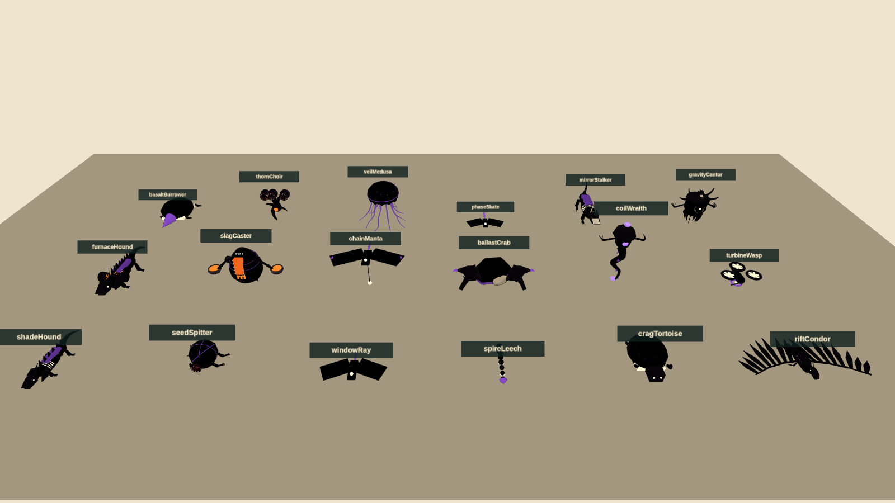

| Species | Region | Role in 3D | Tell and counter |
| --- | --- | --- | --- |
| Shade Hound | Fields | Pouncer that follows Hopper's line across terraces and roofs | Crouch, flash, pounce; ribs open on landing: kick, or stomp the back |
| Seed Spitter | Fields | Rooted sniper on terraces and roof gardens | Throat inflates, three arcing seeds; lasers between volleys, or glide in and kick |
| Window Ray | City | First flyer; hangs between towers | Pause, fold, straight dive; jump over it and stomp the back |
| Spire Leech | City | Wall-clinger that beams across gaps | Eye charge, horizontal beam; flank from another face, or reflect a shot |
| Crag Tortoise | Mountains | Armoured shelf-holder | Rears and lunges uphill, belly shown; never stomp the spikes |
| Rift Condor | Mountains | Thermal-rider that duels in the air | Feather corridor, swoop; bounce off its sternum, or kick as it climbs out |
| Furnace Hound | Foundry | Straight-line charger along belts and decks | Vents, charges; jump it and strike behind, or stomp mid-skid |
| Slag Caster | Foundry | Lobber whose slag becomes stepping stones | Scoop, lob; core opens after each throw |
| Chain Manta | Docks | Tether-puller that drags platforms | Tether drops, load slides; shoot the tether node, bounce off its back |
| Ballast Crab | Docks | Deck-slammer with a shockwave | Rears, slams; jump the wave, hit the rear core |
| Coil Wraith | Launchworks | Lane gate between two nodes | Nodes brighten, beam holds; shoot a node out |
| Turbine Wasp | Launchworks | Dasher that becomes a platform | Intake contracts, dash; kick to stall the fans, then stomp |
| Basalt Burrower | Basin | Erupts under the ground you land on | Cracks trace it; jump the eruption, stomp the soft back |
| Thorn Choir | Basin | Fan-volley chorus on ivory arches | Heads open in sequence; kick one to stagger all |
| Veil Medusa | Drift | The springiest stomp in the game | Bell flashes, radial pulse; lasers pierce the bell; stomp it for a high rebound |
| Phase Skate | Drift | Blink-dasher | Fades, silhouette, solid, dash; free stomp for 0.4 s after it solidifies |
| Mirror Stalker | Inversion | Floor and ceiling lunger | Mask tilts, mirrored lunge; its stance shows its surface |
| Gravity Cantor | Inversion | Local gravity flipper | Prongs count in, volume flips; shoot the core or fly around |

Each species keeps its 2D silhouette, its core and its tell, so a returning player recognises everything. What changes is the space: snipers hold roofs, chasers use Hopper's own routes, flyers own lanes between structures and are also his stairs.

<!-- page -->
## The shadow commanders

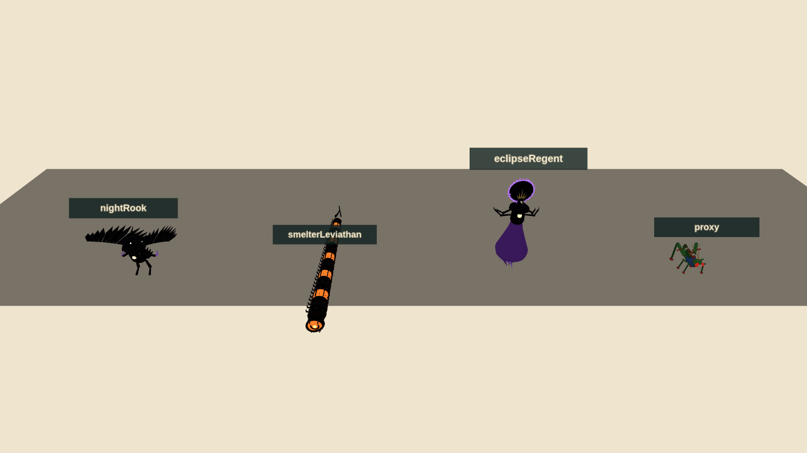

### Night Rook at the transmitter

The mission-one boss fights around the summit mast, on three shelves at different heights and in the air between them. At full health it perches on the mast, marks a dive corridor with a feather trail and sweeps past; the player leaps over the sweep and bounces off its back, or shoots its sternum as it climbs out. It fans blade feathers from the mast top, leaving a gap that has to be glided through. At two-thirds it lands and channels through its wing joints; kicks break the guard and open the core. At one-third the fight goes airborne: the Rook stays aloft and the player fights it entirely by bouncing between condors it summons (capped at two) and the Rook's own back. Its defeat dissolves it around the mast, which lights.

### Smelter Leviathan on the gantry

The mission-two boss is coiled around the gantry elevator tower with the launch ring above. The fight climbs. On the pad the tail sweeps the deck; jump it and kick the exposed joint. Its furnace breath fills one marked side of the tower; wall-kick up the other side and fire into the cooling maw. Higher, it uncoils across the ring pads and exposes cores along its length in sequence; stomping a cracked segment opens the inner core for lasers. The elevator cage is the safe platform between phases, and falling off the tower lands on the pad with a thermal back up. Its last core stops the engine and opens the star gate.

### Eclipse Regent at the cathedral

The final fight is on the eclipse dais before the cathedral facade, in three gravity phases announced by seams and a 1.5 s count-in. Heavy gravity first: crawling shadow rings cross the dais; leap them and kick the lowered hands to open the heart. Low gravity second: marked lances fall between the six mirrored shelves; summoned medusae (capped at two) are the bounces up to heart height. Alternating gravity third: the dais floor and the ring shards overhead swap roles every count-in, the Regent's attacks continue from before, and the heart opens after two successful mechanic interactions per cycle. Lasers shorten the punish; a close kick is the big burst. No hidden bar, no unannounced instant kill. Defeat plays the return to Earth and the credits.

<!-- page -->
## World structure

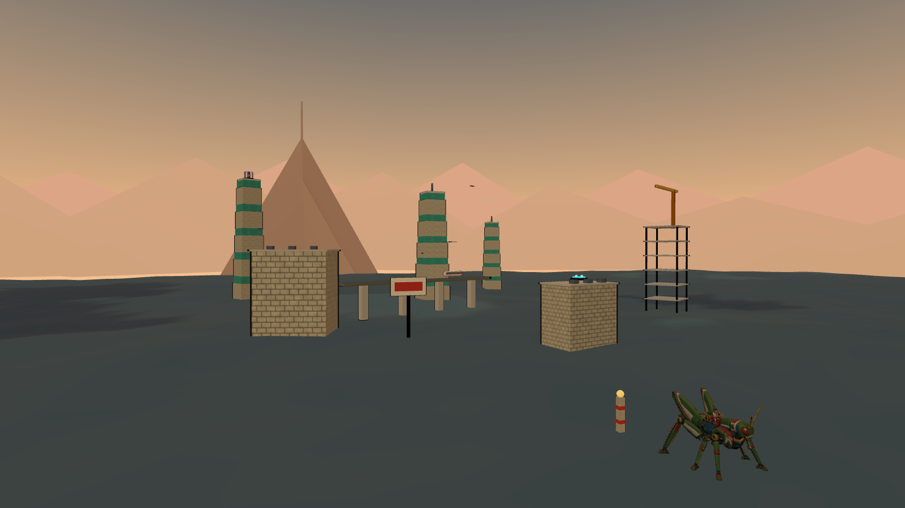

A **region** is an open district about 2.4 km on a side with a main line of roughly 4 km through five chapters, entered at one edge and left at its landmark. It has three vertical bands: the **floor** (0–40 m: fields, streets, decks, basin sand), the **middle** (40–150 m: roofs, ledges, crane booms, arches) and the **sky** (150–350 m: tower tops, masts, rings, reefs), plus a boss or gate arena. The main line moves between bands every chapter, and the horizon landmark is placed so that it is visible from the floor of the first chapter.

| Region | Entrance → exit | Peak climb | Landmark on the horizon |
| --- | --- | --- | --- |
| Sunseed Fields | 0 → 25 m | 60 m terraces | Crownline skyline |
| Crownline City | 0 → 270 m | 300 m observatory | Thunderhead summit |
| Thunderhead Range | 0 → 190 m | 110 m gorge, 300 m summit | The transmitter mast |
| Cinder Foundries | 0 → −50 m | 100 m casting trench | The crane forest |
| Tempest Docks | 0 → 180 m | 130 m upper gantry | The launch spine |
| Skyhook Works | 0 → 300 m | −120 m shaft, 200 m ring | The star gate |
| Vermilion Basin | 0 → 40 m | −90 m basin, 65 m terraces | The black sun |
| Cobalt Drift | 0 → 330 m | 330 m reef ascent | The drift moon |
| Violet Inversion | 0 → 160 m | 160 m cathedral | The eclipse cathedral |

### Chapters

Each chapter is a leg between two landmarks with one dominant beat, keeping the 2D game's forty-five chapter names and their elevation envelopes converted to metres. A chapter is an interlude and the stronghold it walks toward, or the last stretch to the landmark: a checkpoint totem at the interlude's start and at the stronghold's edge, one signal on a high thing, one at the bottom of something and one in a cage, and a way back up from its floor. The last chapter of a region ends at the landmark with a stronghold, or with the mission boss.

### Gravity

| Zone | Gravity | Charged-leap apex | Use |
| --- | --- | --- | --- |
| Earth and industry | 120 m/s² | 140 m | Baseline |
| Vermilion Basin | 1.35× | 104 m | Short, forceful arcs; wide ivory landings |
| Cobalt Drift | 0.55× | 255 m | Long glides between drifting reefs |
| Violet, normal | 0.85× | 165 m | Broad approach to the arches |
| Violet, inverted galleries | 0.85× toward a ceiling | 165 m | Optional ceiling lanes under arches; one required arch |

Inversion is a volume, not a screen: passing a gravity gate or a seam under an arch flips local gravity for whatever is inside, Hopper rotates over 0.25 s to the new surface, the camera keeps the horizon, and the seam arrows show the way out. Cantors flip a marked volume beneath them; they never flip the whole district.

### Checkpoints, signals, cages and capsules

Totems light when reached and are the respawn point. Nine signals per region unlock gallery entries and count on the results screen; three sit on high things, three at the bottom of things, three in cages that only a reflected shot opens. Capsules sit where fights are. Spring pads are the region's elevators, thermals rise from chimneys, furnace doors and vents, and wind lanes cross open gaps.

<!-- page -->
## Mission one · Earthbound Thunder

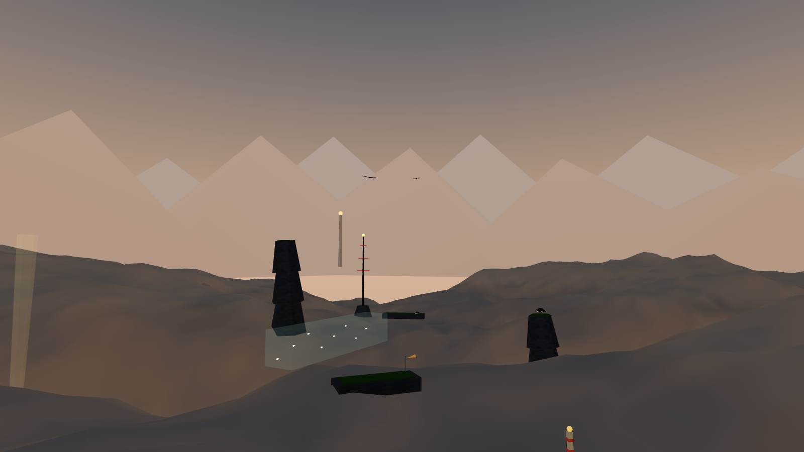

### Sunseed Fields

Honey-coloured morning, terraces, windbreaks, silos and fallen seed vessels. Three interludes and three strongholds: the irrigation lesson (a two-tier terrace on the road, a silo to wall-kick, a patrolling pair of hounds) walks toward the Orchard Granary, three silos close together with hounds crouched on their tops, rays dropping in and spitters rising by the path; the windbreak ridges (a thermal onto the ridge, the irrigation cut) walk toward the Seedfall Granary and its two vessels; the road to Crownline climbs a three-tier terrace toward the Crownline Gate. The Crownline towers stand on the horizon the whole time. Exit: the road to Crownline under the windbreaks.

### Crownline City

Golden sunset, ivory towers with teal glass bands, roof decks, an elevated line with a train, a construction crown with a slewing crane, billboards that tip, and the observatory at the top. The main line climbs 270 m by roof decks, tower ledges and wall-kick corners, through three strongholds: the Ivory Ward (two towers with hounds on the roofs, rays dropping between them, leeches on the faces as the surge), the Construction Crown, and the Highline Observatory, with the roof ladder, the transit canyon (the rail span runs along the street, the train shuttling) and the sky bridges (a spring pad into a wind lane) as the interludes between. Exit: the observatory crown, looking at the summit.

### Thunderhead Range

Slate, apricot storm cloud, an eclipse beginning over the summit. The slate descent steps down toward the Gorge Bastion, four crag columns rising out of the storm gorge past the rim with tortoises leaping from their tops and condors dropping over the edge; the broken ridge climbs out on a spring pad and a thermal toward the Cloudstep Bastion, a ring of crags around a low step; the summit road walks under the mast, visible from the gorge floor as a beacon, into the Night Rook's arena. Tortoises hold the shelves; condors make the ascent an air fight.

### The mission's kit

Terrace steps, farmhouses, silos, windbreaks and seed vessels; ivory towers, roof decks, rail spans, train cars, the construction crown, billboards and the observatory; crag columns, ledge shelves, ravine bridges, windsocks and the transmitter. Seventeen structures, requests M-024 to M-040.

<!-- page -->
## Mission two · The Iron Migration

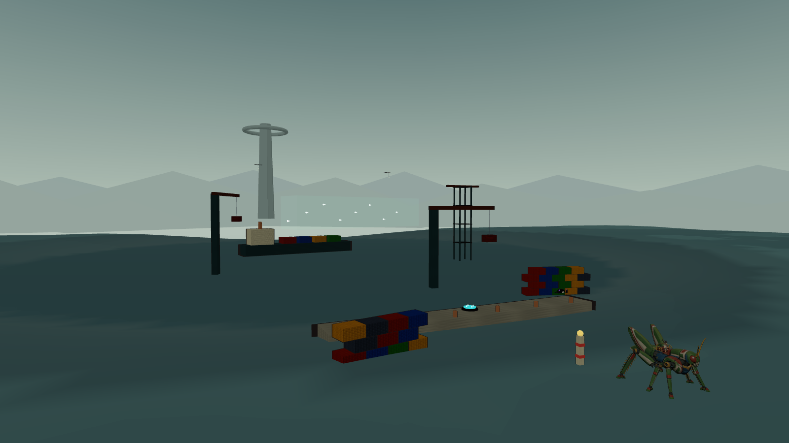

### Cinder Foundries

Ochre smoke and furnace light. Furnace towers with glowing doors that are thermals, conveyor spans that add their velocity to Hopper, chimneys with a thermal above each lip, slag barges on a casting channel whose hot slag lifts anyone who falls in, and stamping presses whose rams fling rather than crush. Furnace hounds charge along the belts; casters lob slag that cools into stepping stones over the channel. The route goes down through the casting trench and out toward the crane forest.

### Tempest Docks

Rain, sea-green steel, white spray. Container stacks are stairs; crane booms slew and carry containers on cables; the gantry tower has four decks and a bridge; the freighter on the storm channel is the chapter's long crossing; the sea beside the breakwater pushes a fallen Hopper ashore. Mantas drag the platforms Hopper is about to land on until their tether nodes are shot; crabs slam the decks. The launch spine stands over the channel and the route climbs the crane forest toward it.

### Skyhook Works

Pale gold above the clouds. The exhaust shaft descends 120 m by baffles with a thermal at the bottom; piston stairs rise and fall out of phase; the gantry elevator rides 140 m beside the rocket; the launch ring crowns the spine 200 m up. Coil wraiths gate lanes between scaffolds until a node is shot; turbine wasps dash and, kicked, stall into platforms. The Leviathan is coiled around the elevator tower, and the star gate opens when it dies.

### The mission's kit

Furnace towers, conveyor spans, chimneys, slag barges, stamping presses; crane booms, container stacks, the freighter, gantry towers, breakwaters; launch rings, rockets, piston stairs, exhaust shafts, gantry elevators. Fifteen structures, requests M-041 to M-055.

<!-- page -->
## Mission three · Beyond the Black Sun

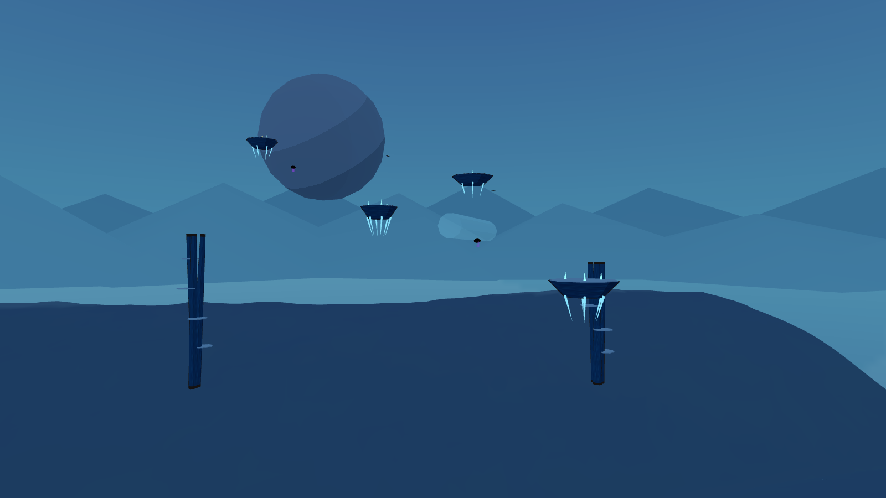

### Vermilion Basin

Red coral, ivory ribs, a black sun. Gravity is 1.35×, so leaps are short and landings heavy; the ivory-topped terraces are wide on purpose. Rib arches are bridges and choir perches; coral spires are cover; the staged coral bridge breaks behind Hopper in three signalled stages, dropping him to the basin floor if he dawdles, where a spring pad waits. Burrowers tunnel under the landings; choirs sing fans from the arches. The route descends into the basin and climbs the terraces toward the eclipse.

### Cobalt Drift

Ultramarine void, stars, a huge moon. Gravity is 0.55× and everything floats: reefs drift on marked dust-current paths, root pillars rise 160 m with shelves, and a 330 m ascent is made by glides, currents and medusa bounces. Medusae are the springiest stomps in the game; skates blink and dash. Falling lands in blue dust that lifts Hopper gently back to the lowest reef. The moon is the landmark.

### Violet Inversion

Dark purple, obsidian arches, ring shards orbiting slowly, glowing gravity seams. Gravity is 0.85×; under every arch a seam marks an optional inverted lane on the lintel's underside, and one arch late in the region must be crossed inverted. Ring shards are landings that rotate through the sky. Stalkers walk floors and ceilings; cantors flip volumes. The cathedral is visible from the first arch and reached at the eclipse dais, where the Regent descends.

### The mission's kit

Ivory rib arches, coral spires, ivory-topped terraces, staged coral bridges; floating reefs, root pillars, dust currents; obsidian arches, ring shards, the cathedral facade, gravity seams, the eclipse dais. Twelve structures, requests M-056 to M-067.

<!-- page -->
## Visual direction

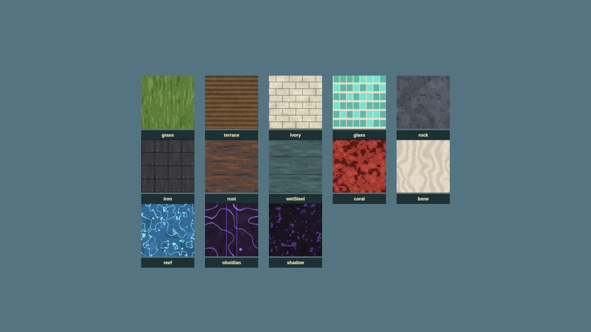

The 2D game's look is 1970s cel animation for characters over gouache landscapes. In 3D that becomes:

- **Cel shading** with a three-tone ramp on characters and structures and a four-tone ramp on terrain, and **ink outlines** by inverted hull on characters and props. No specular, no normal-map micro detail, no physically based gloss.
- **Painted skies**: one equirectangular painting per region with the sun or eclipse placed where the light comes from, seen from inside a dome. The sky is most of every screenshot and carries the region's mood.
- **Gouache textures**: hand-painted tileable albedo with visible brush direction and two or three flat tones. Terrain is vertex-painted in bands by height and slope, so the painting and the collision are the same surface.
- **Haze bands**: exponential fog in the region's haze colour, and two rings of painted horizon cards at 5 km and 6.75 km in the haze tones, so distance reads as it does in the concept boards.
- **Shadows** are only cast by Hopper and by shadows; the world is lit by the painted sky, a directional sun and a hemisphere fill in the region's own colours.

### Palette

The nine region palettes are the exact hex values the 2D game uses, so a 3D region reads as the same place as its painted background.

| Region | Sky | Haze | Accent | Ground |
| --- | --- | --- | --- | --- |
| Sunseed Fields | #739cae | #f8c479 | #ffdf7a | #456747 |
| Crownline City | #b98687 | #f6bd86 | #a1efe3 | #465663 |
| Thunderhead Range | #7c8d9c | #d5ad8d | #e9d09b | #535963 |
| Cinder Foundries | #644d45 | #c28754 | #ffb454 | #4d4345 |
| Tempest Docks | #667d84 | #b1c0b5 | #b4f2df | #3e5d61 |
| Skyhook Works | #a5a9a5 | #efe0bd | #ffd38c | #716566 |
| Vermilion Basin | #6c2533 | #de765d | #fff0bc | #9a4348 |
| Cobalt Drift | #193d77 | #478bab | #b9fff1 | #355d91 |
| Violet Inversion | #251633 | #60436c | #e5b8ff | #503653 |

Shadows keep their language: charcoal interiors, violet contours, pale cores; furnace species glow orange. Hopper keeps his green, cream, red, blue and gold. Saturated red-white is reserved for lasers, amber-white for danger tells, teal for the guard, violet for gravity.

### Scale cues

Hopper is huge, and the world must keep saying so: farmhouses to his knees, train cars he can stand on, containers as stairs, windbreak trees at his shoulder. Every kit piece is built to a real size and the stand-in sizes in the request documents are the model sizes.

<!-- page -->
## Structures, props and the stand-in policy

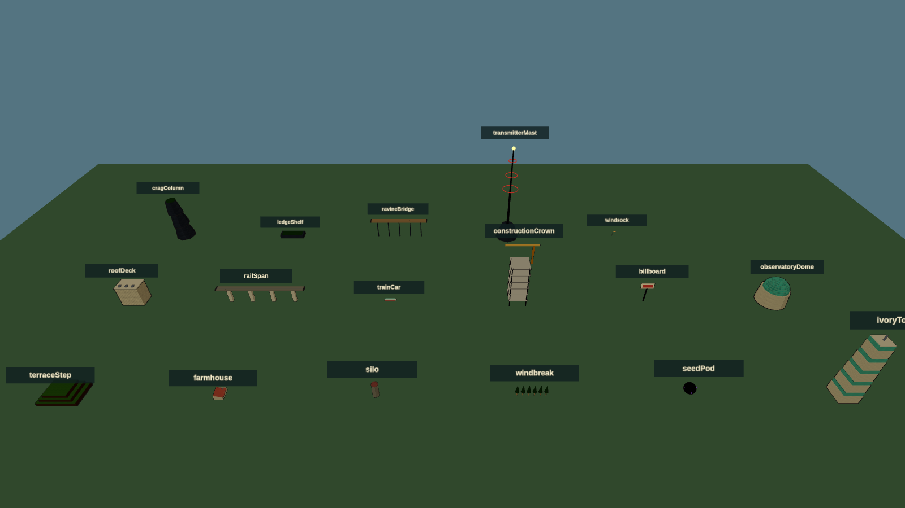

Forty-four structure pieces in nine kits, one trim sheet per kit, are what the districts are built from. Each piece publishes its **landings**, the flat tops a route may use, and the level tools place jumps against those, not against the mesh, so a stand-in and its final model are interchangeable if their landings agree within half a metre. Moving pieces (train, crane boom, piston heads, elevator cage, press ram, barge, reefs, ring shards) are rigid hierarchies driven by transforms.

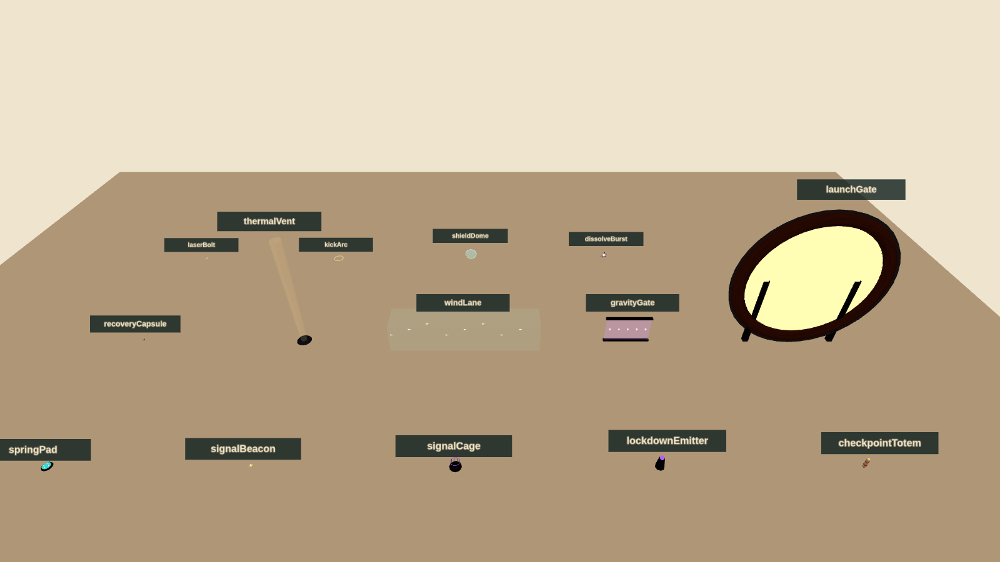

### Stand-ins

Every model, texture and sky in the request documents has a procedural placeholder, built from primitives with cel materials and ink hulls, in `hopper/3d/standins/`. They are the same size as the requested model, expose the same named sockets, publish the same landings and animate a little, so gameplay code binds to names that survive the swap. Textures are painted in code into data textures, skies are gradient-plus-sun paintings, terrain is a heightfield whose colour and collision share one function, and the horizon is a ring of silhouettes in the haze colour.

The manifest maps each request to its stand-in and its final file. When an asset arrives, its status flips from `stand-in` to `delivered`, the loader takes the GLB or texture, and the stand-in stays available for tests. A build with any stand-ins left shows a small "stand-in art" mark in the corner and must not be the public build.

<!-- page -->
## Title screen, menus, HUD and sound

The title screen is the one the 2D game ships: the painted poster with the boy on Hopper's back, the generated logo, Press Start, the play-select screen with Continue and the three episodes, and Instructions, Settings and Fullscreen at the bottom right. The 3D edition uses the same React components and the same poster; the only visible difference is the controller diagram, which shows the 3D mapping, and a "3D" mark on the episode list. Fullscreen on start, any fresh controller button from the idle title, left stick for utility navigation, all as the collection guidelines require.

### HUD

Six armour pips top left with the laser heat gauge beneath them, as before. New: the landing guide ring in the world, height ticks at the screen edge while airborne, the lock-on brackets at a locked core, a small horizon compass strip at the top showing the landmark, the next totem and nearby signals by bearing, and the guard energy arc around the shield while B is held. Boss health appears only in boss arenas. Nothing sits where the rider or the next landing would be.

### Pause and settings

Pause keeps Resume, Instructions, Settings, Restart Checkpoint and Return to Title with the confirmation rules. Settings add camera sensitivity and inversion for both axes, field of view, landing guide (always, airborne only, off), lock-on style (hold, toggle), reduced motion, vibration, and the existing master, music and effects levels, dead zones, subtitles and high-contrast threat outlines. Preferences persist locally.

### Music and sound

The three supplied recordings keep their roles: **Hopper the Grasshopper** on the title and menus, **Grass March 1** through missions one and two, **Dark Moon** through mission three. Track positions are preserved across scenes, tabs and pauses, and pause ducks rather than switches, exactly as the shipped audio module does; the 3D edition reuses that module. Effects gain position and distance: laser pulses, kicks, stomps, dissolves and enemy tells are placed in the world so an ambush from behind is heard behind. Wind rises with height and speed in a glide. Boss telegraphs duck the music briefly. Every mandatory cue has a visual equivalent.

<!-- page -->
## Technical plan

The 3D edition is a second entry in the same repository, sharing the shell, input and audio code with the 2D game and adding a 3D world, simulation and renderer.

- **Rendering:** three.js (r185, the version the stand-ins use) over WebGL2. `MeshToonMaterial` with ramp textures, inverted-hull outlines, exponential fog, one shadow-casting light for Hopper and nearby shadows, sRGB output. Instanced kit pieces; three LOD levels per structure; painted horizon cards and sky dome; streaming in 400 m cells around the camera.
- **Models:** the delivered GLBs loaded with the meshopt decoder and `KHR_mesh_quantization`, as `models/README.md` describes; final assets follow the same conventions. The rider binding helper in `models/attachments.js` is used for the separate files; the combined file needs no binding.
- **Simulation:** fixed 120 Hz steps as in the 2D engine. Hopper is a capsule (5 m radius, 14 m tall) against a heightfield sampled from the region's heightmap plus box and convex colliders from the structure kits. Fast states (dive, super leap) sub-step four times so nothing tunnels at 90 m/s. Moving platforms carry what stands on them.
- **Enemies:** state machines with tells, attacks and recoveries in the manner of the shipped combat module, on a **perch graph** of landings rather than a navmesh: ground shadows move between landings they can reach, flyers along authored lanes. Waves and knots as described; a stronghold's host waits on the perch graph's tops in view.
- **Camera:** a follow rig with spring collision, the lock-on and Horizon View rigs, and the leap and glide framing rules above.
- **Input and audio:** the shipped `input.ts` (all connected pads combined, keyboard fallback, connection handling) with the right stick, triggers and bumpers added; the shipped `audio.ts` with a panner per effect voice.
- **Shell:** the shipped React title, play-select, HUD, pause, settings and instructions with the 3D diagram and the new settings.
- **Saves:** local, per checkpoint, with cleared knots, signals and settings.
- **Build:** a second static entry, `hopper/3d/index.html`, built by the same Vite Pages configuration and published at `/mini/hopper/3d/` beside the 2D game. The stand-in viewer is already published at `/mini/hopper/3d/viewer/`.

### Performance budget

| Item | Budget |
| --- | --- |
| Target | 60 fps at 1080p on an integrated GPU; 30 fps floor on a 2019 laptop |
| Draw calls | under 600 in a district view; instancing for kit pieces |
| Triangles on screen | under 1.5 M, with LOD 1 beyond 300 m and cards beyond 1.2 km |
| Textures resident | under 256 MB per region; skies as KTX2 |
| Simulation | under 2 ms per frame including enemies |
| Load | a region streams in under 4 s from a warm cache |

### Testing

- **Simulation tests in node**, like the shipped engine tests: the jump family reaches its stated apexes and ranges in every gravity; falling never damages; the way-back-up rule holds from every floor sample; enemies' tells last their stated time.
- **Route audits**: for every chapter, every required landing pair is within the jump model with a 25% margin; every knot has a visible route around it; every floor has a return within 20 s at run speed.
- **Stand-in tests** (already in place): every request's stand-in builds, exposes its sockets and landings, matches its size, and the manifest and registry agree.
- **Visual QA** with headless renders (the figures in this document are made that way) and browser checks on the agreed matrix, plus physical Xbox testing recorded separately from simulated input.

<!-- page -->
## Asset plan

The asset requests are separate documents so they can be worked and updated independently: `model-requests.md` (93 models) and `image-requests.md` (47 images and textures, round one) and `image-requests-round-2.md` (32 model reference sheets, round two), both generated from `source/build_requests.py` together with `standin-manifest.json`.

| Family | Requests | State |
| --- | --- | --- |
| Hopper and rider | 1 delivered model; 2 clip requests | Models delivered; new clips open |
| Shadow species | 18 skeletal, blend-shape, spline or rigid rigs | Stand-ins in place |
| Commanders | 3 bespoke rigs | Stand-ins in place |
| Structure kits | 44 pieces in 9 kits, static or rigid | Stand-ins in place |
| Props and effects | 15 | Stand-ins in place |
| Landmarks and terrain | 9 landmarks; 9 terrain sculpts | Stand-ins in place |
| Skies, horizons, terrain sets, trim sheets | 9 of each | Procedural placeholders in place |
| Reference sheets (turnarounds, kit sheets, props, Hopper poses) | 32 | Open; generated before the models they describe |
| Interface and effects images | 11 | 3 delivered (poster, cards, 3D diagram); ramps procedural; 7 open |

### Rigging in one page

Every model request names one of five rig types. **Skeletal** rigs (hounds, tortoises, crabs, casters, stalkers, the Rook and the Regent) are skinned skeletons with listed joints, clips and sockets. **Blend shapes** on skeletal rigs give the organic tells: a spitter's throat, a choir's heads, a medusa's bell. **Spline chains** (leech, wraith, the Leviathan) are bone chains the game drives along curves. **Rigid hierarchies** (wasp, cantor, skate, cranes, pistons, gates) are parts on named pivots moved by transforms. **Static** meshes (most structures) have no rig; belts scroll their UVs. Every creature has `Core`, `Hitbox.Body` and a `Mouth` or `Emitter`, and everything stompable has a `Landing` socket. The Hopper rig already exists; its requests are clips only.

### References before models

No model is started from a single side-view sprite. Every model request names the art it must match and a reference sheet that is generated and approved first: a turnaround for each species and commander, a kit sheet per region drawn at a shared scale with Hopper, a props sheet, and a pose sheet for Hopper's new clips. These are the second round of image requests, `image-requests-round-2.md`, added after the first round had begun; it maps every sheet to the models that wait on it.

### Order of arrival

Art can arrive in any order because the stand-ins hold every slot, but the order that helps most is: the reference sheets for mission one, the Hopper clips (glide and dive change how the game feels), the four mission-one species, the Sunseed and Crownline kits and skies, the Night Rook, then the rest by mission. Paintings should be checked in the viewer against the stand-in they replace before they are committed.

<!-- page -->
## Production plan

| Milestone | Deliverable | Exit criteria |
| --- | --- | --- |
| M0 · Design and stand-ins | This document, the request documents, the stand-in library and viewer | Delivered with this document |
| M1 · First leap | Sunseed district playable: controller, camera, the jump family, glide, dive, wall kick, mantle, landing guide, terrain and kit collision, the animated GLB | Ten minutes of free roaming feels good to three people; the skyline is visible from the start; nothing kills |
| M2 · Shadows | Combat core with hound, spitter, ray and leech; armour, lasers, kick, stomps, dive, lock-on, guard, knots, dissolves | Air-stomp chains work; a knot fight is fun on standard and readable on relaxed |
| M3 · Earthbound Thunder | Three districts authored with the kit, chapters, totems, signals, cages, capsules, the Night Rook; title, play-select, HUD, pause, settings, save | Mission one playable start to finish; route audit and simulation tests pass |
| M4 · The Iron Migration | Moving structures, belts, thermals, wind, tethers, presses; six species; the Leviathan | Mission two playable; performance budget met in the docks |
| M5 · Beyond the Black Sun | Gravity volumes, drifting reefs, inversion galleries, six species, the Regent, transitions, ending | Full campaign playable; Dark Moon routed |
| M6 · Polish | Streaming, LOD, accessibility, instructions, controller QA on the browser matrix, results and gallery | Acceptance checklist of the collection guidelines passes |
| M7 · Art swap | Final models, skies and textures replacing stand-ins as they arrive, from M1 onward | No stand-in mark in the public build |

Milestones one and two are the ones to spend tuning time on; everything after them is content on a proven feel. Mission one can ship alone if the campaign needs to be staged.

### Risks

| Risk | Mitigation |
| --- | --- |
| Landing in 3D feels uncertain | Landing guide, flat-top language and height ticks from M1; measured in the M1 test |
| Camera inside dense structures | Spring collision, landings kept 10 m from walls, kits designed with open corners |
| Performance on integrated GPUs | Toon shading is cheap; instancing, LOD and cards from M3; budget checked each milestone |
| Ninety-three models | Kits share trim sheets; stand-ins hold every slot; mission one first |
| Open districts lose the route | The landmark rule, Horizon View, the compass strip, totems at every chapter |
| Only-shadows-hurt makes hazards toothless | Hazards move Hopper a long way; knockback off a roof is the real cost |

### Decisions for this review

- The four new verbs and their buttons: glide on held A, dive stomp on Y, crouch charge on RB, Horizon View on LB, lock-on on LT.
- District size (2.4 km) and the ten-minute region.
- Falling never hurts; hazards push and never damage; knockback is the cost.
- All-round kick with a front-only guard.
- Shipping as a second entry beside the 2D game with the same title screen.
- The order in which art should arrive.

### Delivered with this document

The design text and its Word and PDF renders; `model-requests.md` with rig types for all 93 models; `image-requests.md` for 47 paintings and textures; `standin-manifest.json`; the stand-in library with tests; the review viewer with nine dioramas and seven contact sheets, published beside the game; the 3D controller diagram; and the rendered figures in `design/assets/`.
