# Hopper the Grasshopper
## Illustrated game design proposal

A 2D action platformer about an enormous insect robot and the small boy riding on its back. Leap across farmland, skyscrapers and mountains, break an industrial invasion, then cross the shadow monsters' home planet.

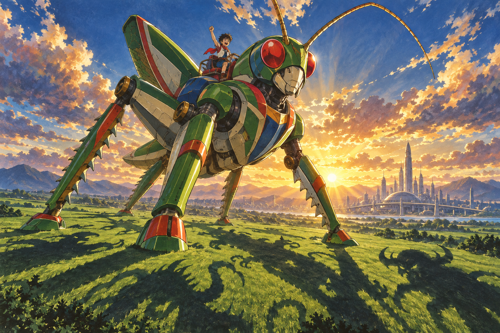

This document presents the gameplay, campaign, visual identity and asset plan for review. The recommended direction combines the supplied character design with 1970s anime cel animation and painted landscapes. All names and numerical balance values below are proposals for playtesting. The generated plates establish an artistic direction; they are not finished gameplay sprites or playable screenshots.

The next step is approval or revision of this design. Game implementation begins only after that review.

<!-- page -->
## The experience

Hopper should feel enormous in relation to the world and precise under the player's thumb. A farmhouse barely reaches his knees. A normal leap clears a valley; an extended leap carries him between towers. His hind legs compress, snap open and recoil visibly. The small boy leans into the motion, his scarf trailing behind.

The story is brief and visual. Shadow creatures arrive in falling seed-like vessels and root themselves into Earth. Hopper follows their migration from the countryside into the metropolis and up to an alpine transmitter. The second mission destroys their industrial launch infrastructure. A captured launch gate sends Hopper and his rider to the source of the invasion. Defeating the Eclipse Regent closes the gate and returns them home. The boy remains a companion and scale reference, with no separate escort health bar.

### Campaign rhythm

| Mission | Environments in order | First clear target |
| --- | --- | --- |
| 1 Earthbound Thunder | Sunseed Fields / Crownline City / Thunderhead Range | 18–22 minutes |
| 2 The Iron Migration | Cinder Foundries / Tempest Docks / Skyhook Works | 20–24 minutes |
| 3 Beyond the Black Sun | Vermilion Basin / Cobalt Drift / Violet Inversion | 22–26 minutes |

Each environment occupies approximately 5–7 minutes; its final major boss adds 3–5 minutes to the mission. Total campaign target is 60–72 minutes excluding retries, with shorter repeat clears. Duration comes from varied traversal and combat, never waiting for long timers or padding enemy health.

Each area teaches a pattern safely, varies it, combines it with combat, and ends in a memorable traversal or encounter. Every 60–90 seconds, shift the silhouette, elevation, encounter structure or vista. Offer short quiet stretches after demanding fights. Optional routes add 30–60 seconds and rejoin the main path.

The loop is read the terrain, choose a leap, steer through attacks, strike, land and accelerate again. Progress is earned by reaching the next landmark and defeating required guardians; ordinary enemies need not all be cleared.

<!-- page -->
## Hopper and the rider

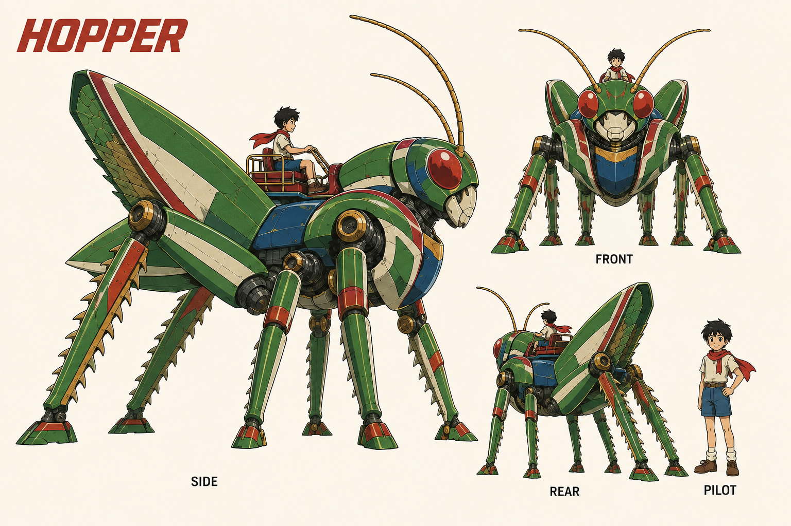

### Identity to preserve

Hopper has a forward insect posture, six legs, two enormous folded hind femurs, long serrated hind tibiae, green armor, cream faceplate, red oval eyes, a blue chest, red trim, gold joints and paired segmented antennae. Keep the reference's generous mechanical volumes and expressive eyes. The four smaller legs support running; the large back legs deliver every melee attack. No humanoid fists or front-leg punches.

The rider has short untidy black hair, a cream shirt, navy shorts, boots and a red scarf. A small rail and harness secure him to the saddle. His gameplay height is about one ninth of Hopper's body height. The enlarged costume study on this sheet is for detail, not scale. Hopper's proposed standing height is 18 metres; architectural cues carry this fiction without imposing literal physical units on movement tuning.

The large right-facing profile is the primary production reference. Approve one cleaned silhouette and a set of joint landmarks before creating animation. Secondary views establish construction; they must be reconciled to the approved profile wherever generated proportions differ. Copy its identity into all later prompts and inspect limb counts, saddle placement and scale in every output.

### Paint and line

Use confident dark ink, two or three cel tones per surface, restrained brushed wear and warm highlights. Backgrounds carry the dense gouache texture; moving characters retain broad readable color shapes. Shadow creatures have charcoal interiors, violet contours and pale exposed cores. Reserve saturated red-white light for Hopper's lasers and amber-white pulses for danger telegraphs.

<!-- page -->
## Controls and instructions

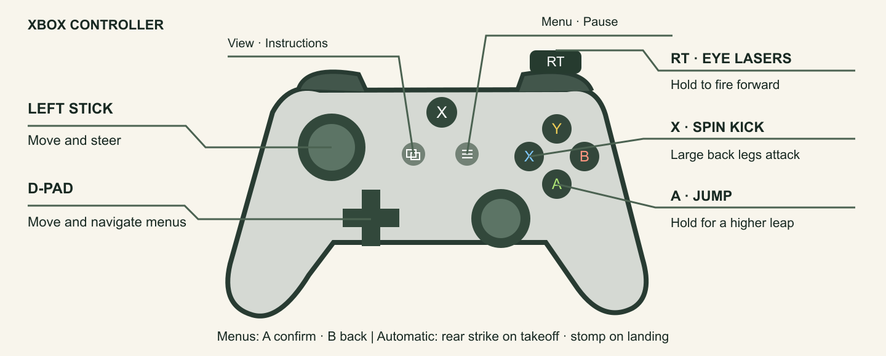

| Xbox input | Gameplay action | Keyboard fallback |
| --- | --- | --- |
| Left stick or D-pad left/right | Move, turn and steer in air | A/D or left/right arrows |
| A tap / hold | Short jump / higher longer jump | Space tap / hold |
| X | Spin kick using the large back legs | J |
| RT hold | Fire eye lasers forward | K or left mouse button |
| Left stick up/down while still | Look above or below | Up/down arrows |
| Menu | Pause or resume | Escape |
| View | Open instructions with play paused | I |

A jump automatically attacks behind Hopper at takeoff. Landing feet-first on a vulnerable enemy automatically stomps it. Neither needs another button. Holding A during a successful stomp gives a higher rebound; releasing A produces a smaller controllable bounce.

A confirms menu choices, B goes back, and the left stick or D-pad moves focus. Sliders accept left/right; shoulder buttons may switch instruction pages, with focusable on-screen alternatives. Y, B, LB, RB, LT and right stick have no required combat actions. This keeps the essential scheme to movement and three actions.

The instruction screen opens with the objective and diagram, then shows a short illustrated example of each attack. Explain “eyes forward, launch behind, feet downward.” Include text mappings and keyboard equivalents. All pages must be readable and dismissible using the controller. Distinguish Menu from View and leave the Xbox system button unassigned.

<!-- page -->
## Movement and the camera

Use a responsive simulation at 60 Hz with animation timing independent of physics. Let H mean Hopper's gameplay body height from feet to head, excluding antennae and rider. These are initial tuning targets, not measured results.

| Parameter | Starting target | Intended result |
| --- | --- | --- |
| Ground speed | 6 H per second | Rapid ground coverage |
| Acceleration / stopping | 0.18 s / 0.12 s | Heavy pose changes with quick control |
| Tap jump | 1.4 H apex, about 1.1 s airtime | Accurate short traversal |
| Full held jump | 4.5 H apex, about 2.0 s airtime | Up to about 12 H at full speed |
| Hold window | First 0.32 s after launch | Higher jumps without charging on ground |
| Air steering | 70% ground acceleration | Strong corrections without instant teleporting |
| Coyote time / input buffer | 120 ms / 140 ms | Forgiving ledges and landing inputs |

Jump launches immediately. Holding A sustains the launch impulse during the hold window; releasing A cuts upward velocity. No double jump. Horizontal direction can change in air, but acceleration preserves a legible arc. Build required gaps at no more than 75% of the tested maximum in that area's gravity, leaving room for combat and correction.

The default view shows roughly 20 H horizontally; Hopper occupies about 9% of screen width including his long body. Pull back smoothly toward 28 H for extended flight and boss reveals, then settle near the next landing. Do not zoom so far out that threats or the rider disappear. The exact framing will be checked with production sprites.

Camera look-ahead follows velocity and the authored route, with vertical bias toward the next landing. Wide safe shelves precede blind changes in elevation. Reveal a destination before asking the player to jump. Downward routes use visible tiers, not blind death drops. Keep world movement continuous across area boundaries, with a brief named environment card and a checkpoint.

The left stick retains screen-relative left/right movement even in reversed gravity. Facing follows deliberate horizontal input; neutral input retains facing. A turn takes effect promptly and preserves the active attack's recorded strike direction until its swing ends.

<!-- page -->
## Combat rules

| Action | Reach and timing proposal | Damage role |
| --- | --- | --- |
| Eye lasers | Paired forward pulses, 8 volleys/s; range 12 H | Each volley 1 damage, stable ranged pressure |
| Hind-leg spin kick | 0.08 s windup, 0.18 s active, 0.20 s recovery | 4 damage, rear-first sweep through a 2.2 H radius |
| Jump takeoff strike | Rear legs active for first 0.16 s; reach 1.8 H behind | 3 damage and launch stagger |
| Stomp | Feet contact while descending toward a vulnerable surface | 5 damage and controlled rebound |

The kick sweeps behind first, then above and ahead as Hopper rotates. Both large back legs remain the visible striking limbs throughout. It works on the ground and in the air. Grounded kicking briefly reduces speed; aerial kicking preserves the arc. No invulnerability is granted just for kicking. A jump can cancel the last half of kick recovery; buffered inputs cannot create repeated hits from a held X.

Lasers originate at the eye sockets, travel in the facing direction and collide with scenery. A forgiving vertical capsule tolerates small sprite-height differences; there is no automatic 360-degree targeting. Fire while running, jumping or kicking. Frame-specific eye anchors follow the animated head, while the firing direction remains the chosen screen-horizontal facing for predictable aim. An optional gentle aim assist widens vertical tolerance without turning shots backwards.

Holding RT fills a heat meter in approximately 3.5 seconds; releasing it fully cools from maximum in 2 seconds. Overheating locks lasers for 1.1 seconds and signals visibly. Melee remains available and does not consume heat. This gives close combat a purpose without limiting ammunition. RT uses a dead zone and threshold hysteresis to avoid controller noise.

An attack can damage the same enemy only once per swing or launch. A stomp requires feet crossing a vulnerable surface toward local gravity, with the torso previously clear of the enemy. Side collisions are damage, not stomps. Resolve a valid damaging stomp before enemy contact damage in the same simulation step. An armored crown clearly rejects stomps; exposed backs and cores advertise safe targets.

Light foes have about 3–5 health; specialists 6–10; armored enemies 12–16 with visible vulnerability cycles. Normal enemy windups last 0.45–0.9 seconds. Avoid unavoidable simultaneous attacks; no damaging off-screen spawn. Large hits use brief local hit-stop, weighty sound and optional restrained shake. The boy reacts without obscuring the next threat.

<!-- page -->
## Animation direction

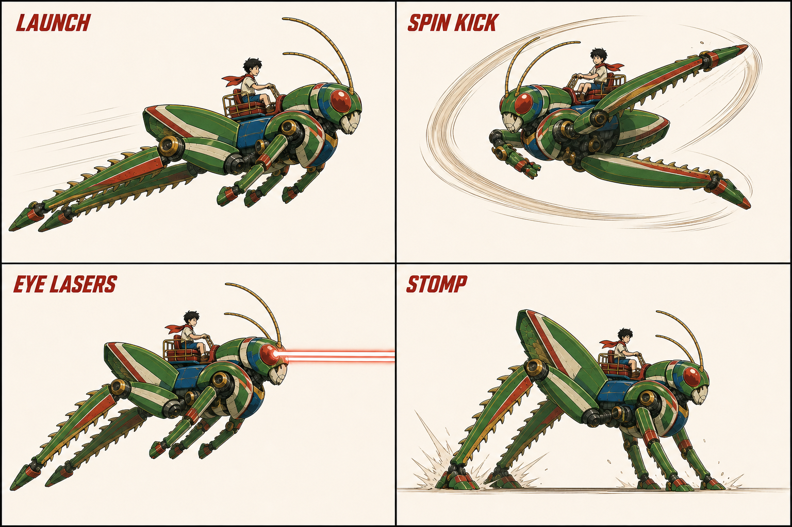

### Movement with weight

Animate on a 12–16 drawing-per-second cadence over smooth simulation. Use a 10-frame run cycle with alternating support legs and clear hind-leg compression; 6 idle frames; 8 launch/rise/apex poses; 4 fall poses; 6 landing/recovery frames; a 12-frame spin-kick cycle; 4 hit poses; and 8 defeat or recovery poses. These are production budgets to refine after testing silhouettes.

The launch anticipation must fit inside the responsive input window rather than delaying the jump for a long squash. The back legs extend behind, tuck under the body in flight and open toward the landing. A stomp compresses the suspension before rebounding. The rider braces, scarf and antennae lag behind, then settle after impact. These secondary motions must not add noisy collision shapes.

This image is an action-direction study. It is not a registered frame sheet: each pose must be rebuilt against the canonical joint positions before export. Generate contiguous short sequences from the same approved character reference and the preceding accepted key pose; do not accept independently redesigned frames.

Every frame has a consistent canvas, body scale and root pivot, plus anchors for eyes, hind feet, saddle and damage regions. Collision shapes follow authored attack windows, not the opaque bounding box. Inspect both facings, silhouette thumbnails and slow-motion playback for extra limbs, disappearing rider parts, sliding joints and texture flicker. Generate corrections through the same image workflow. Do not substitute procedural character geometry.

<!-- page -->
## Level 1 Earthbound Thunder

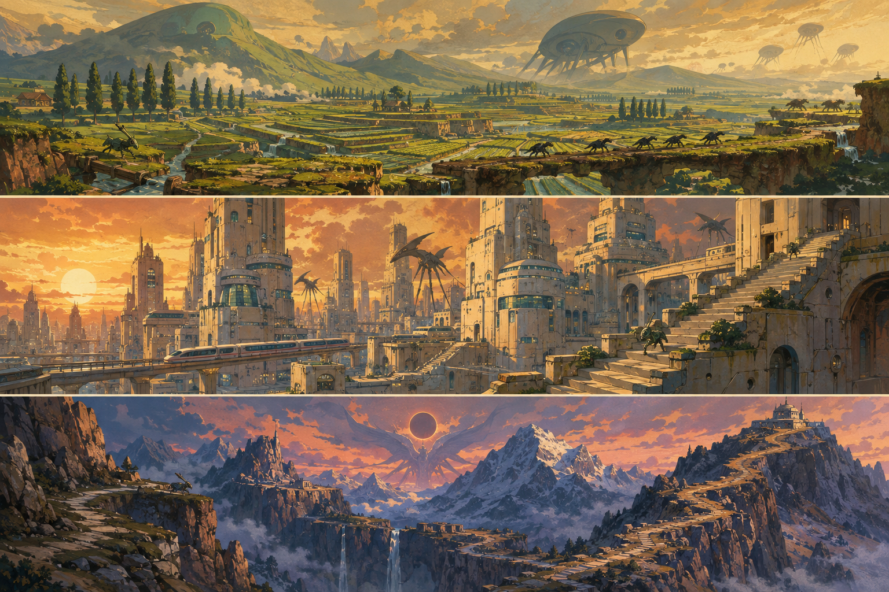

Sunseed Fields begins in honey-colored morning light, with lush terraces and immense distances under a huge sky. Crownline City shifts to golden sunset, ivory towers, teal glass and elevated trains. Thunderhead Range cools into slate rock, apricot clouds and a threatening eclipse above the summit.

The music grows from acoustic guitar, flute and warm brass into urgent strings and timpani. Footsteps move from soil thumps to steel resonance and rock fracture. Small trees, train carriages and distant villages continually establish Hopper's scale.

The route starts broad and horizontal, climbs approximately 35 H through the city, descends 18 H into an alpine gorge, then ascends 45 H toward a summit arena. These are authored-route targets with switchbacks and landings, not a single enormous jump. Total main-route travel is about 2,400–3,000 H including vertical movement and encounters.

<!-- page -->
## Earth encounters and routes

### Sunseed Fields

Spend 5–6 minutes crossing irrigation cuts, planted terraces and windbreak ridges. The opening minute safely teaches tap versus held A. Introduce a following Shade Hound so takeoff's backward strike has an immediate use, then a Seed Spitter at eye height to teach lasers. A row of slow unarmored hounds offers the first stomp chain. Finish with a broad crossing while seed pods burst behind the player.

Shade Hounds are low angular quadrupeds with luminous ribs; they crouch, flash and pounce. Seed Spitters resemble rooted ink-black flowers; their throats inflate before launching three arcing seeds. Hounds invite a backward launch strike; spitters invite ranged fire between volleys. A safe upper ridge offers a collectible and a view of the city.

### Crownline City

Spend 5–6 minutes bounding over rooftops, rising through construction decks and briefly descending a transit canyon. Roof heights form visible launch ladders. A moving train is a safe moving platform, never an escort objective. A collapsing billboard teaches committing to a leap after a clear shake and sound cue.

Window Rays are flat winged silhouettes that pause before a straight dive; jump above their pass and stomp the exposed back, or shoot on approach. Spire Leeches cling to walls and project horizontal beams after a visible eye charge. Reach their flanks from another tier and kick. Combine one ray with one leech only after both have appeared alone.

### Thunderhead Range

Spend 5–6 minutes descending a stepped gorge, then climbing broken ridges and spanning giant ravines. Predictable gust lanes bend the flight slightly; particles, grass direction and windsocks reveal their timing before takeoff. Gusts never reverse controls or carry a committed safe jump beyond its destination.

Crag Tortoises have jagged armored crowns and soft pale bellies revealed during a slow uphill lunge. Shoot when open or kick the flank; never reward stomping the spikes. Rift Condors are skeletal crescent-winged flyers that mark a dive corridor before swooping. The final ascent combines the two around wide recovery shelves. Defeat the Night Rook at the mountain transmitter to clear the mission.

Checkpoints appear at each area entrance, approximately every 90–120 seconds through the route, and immediately before the boss. Falling returns Hopper to the last stable ledge with one armor pip lost; reaching zero restarts the checkpoint.

<!-- page -->
## Level 2 The Iron Migration

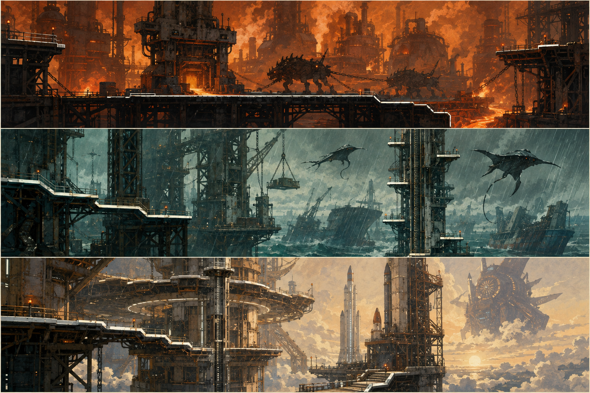

Cinder Foundries uses ochre smoke, orange furnace light and dark iron. Tempest Docks changes to rain, oxidized sea-green steel and white spray. Skyhook Works opens into pale gold sunlight above the clouds, with rust-red launch rings and immense vertical machinery.

Use brushed metal percussion, bass ostinatos and strained brass. Conveyor cadence and warning bells become rhythmic landmarks. Rain thins as the route climbs into the launchworks. All dangerous machinery has visible cycling states and an audio cue that also has a visual equivalent.

The foundry route moves right and down through a 20 H casting trench. Dock cranes lift the route approximately 40 H, then a cargo run carries it across a 25 H bay. Skyhook Works descends 25 H through a cold exhaust shaft before climbing 60 H along the launch spine. Main-route travel is approximately 2,500–3,200 H. Industrial mechanics add timing to familiar jump control.

<!-- page -->
## Industrial encounters and routes

### Cinder Foundries

Spend 5–6 minutes on conveyors, safe slag barges and stamping decks. Begin with an empty conveyor to show that movement adds to its velocity. Then introduce a press with a long warning stroke, followed by a fight on a noncrushing deck. A side route crosses cooling molds for an optional rescue capsule.

Furnace Hounds have broad vented shoulders and ember seams. They charge in a straight line after venting; jump over them and strike backwards as they pass. Slag Casters are pot-bellied soot silhouettes with ladle-like forelimbs; they lob pools that cool into safe stepping stones. Eye lasers interrupt an exposed casting core, while closed armor deflects visibly. Their orange accents sit inside pale outlines so they remain legible against furnaces.

### Tempest Docks

Spend 5–6 minutes leaping between suspended containers, climbing crane booms and crossing an open storm channel. Crane platforms stop at readable endpoints. Wind affects only marked open-air lanes; the safe deck before each lane lets the player judge the gust. A broken freight bridge creates the area's long downward leap toward a broad ship deck.

Chain Mantas are hook-winged flyers that telegraph a tether line before pulling a marked cargo platform sideways. Shoot the tether node or wait for the return sweep. Ballast Crabs are wide, heavy creatures with anchor claws; they rear up before slamming a deck and exposing their rear core. Circle via a short jump, then back-leg kick. At most one tether affects a landing zone at a time.

### Skyhook Works

Spend 6–7 minutes riding a launch elevator, dropping through safe exhaust chambers, then climbing scaffold rings beside a charged rocket. Pistons create temporary stairs with generous dwell times. A sparking exhaust line announces each vent; required routes always offer cover without perfect timing.

Coil Wraiths are tall ribbon-shaped shadows suspended between electrical nodes. Destroy an exposed node with lasers to interrupt a lane beam. Turbine Wasps have three blunt fan lobes and a pointed tail; their intake ring contracts before a dash. A back-leg spin breaks their guard, making a follow-up stomp possible. The area ends with the Smelter Leviathan wrapped around the launch gantry.

Defeating the boss frees the launch gate. A short illustrated transition shows Hopper and the boy entering a star tunnel; skip or advance the sequence with A, preserving controller ownership.

<!-- page -->
## Level 3 Beyond the Black Sun

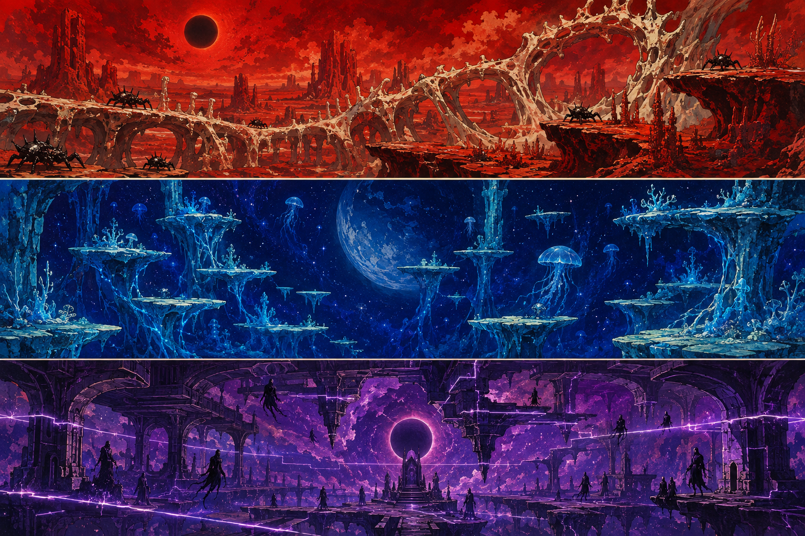

Vermilion Basin is red coral, ivory ribs and dense heat beneath a black sun. Cobalt Drift is an ultramarine void of floating reefs, cyan roots and luminous dust. Violet Inversion is a dark purple cathedral of obsidian arches, broken planetary rings and glowing gravity seams.

Analog synth, wordless choir and unusual percussion take over from Earth's orchestration, while the brass melody survives in fragments. Gravity boundaries have a recognizable rising or falling tone and an arrow symbol. Silence before the final arena makes the Regent's first note unnerving.

The red route uses shorter horizontal gaps and a 20 H descent into a basin, followed by a terraced climb. Blue opens into a 70 H floating-island ascent with a long safe descent between reefs. Purple alternates floor and ceiling pathways through approximately 50 H of vertical displacement before the central eclipse chamber. Main-route travel is approximately 2,800–3,500 H.

<!-- page -->
## Alien encounters and routes

### Vermilion Basin

Spend 6–7 minutes in 1.35× Earth gravity. Legs compress deeply and landings carry extra bass, while ground acceleration stays responsive. Wide ivory landing shelves and short stacked terraces make the lower jump arc understandable. A red coral bridge breaks in three clearly signaled stages and ends on a broad basin floor.

Basalt Burrowers have blunt drilling snouts and broken dorsal plates. Ground cracks trace their path before they erupt; jump over the eruption and stomp their unarmored backs as they emerge. Thorn Choirs are stationary fans of pointed masks that sing a spreading projectile fan. Shoot between pulses, then kick a nearby choir to stagger the group. Do not aim their fans at an unavoidable heavy-gravity landing.

### Cobalt Drift

Spend 6–7 minutes in 0.55× Earth gravity. Jumps linger, so horizontal braking and early A release matter. Broad floating reefs lead into narrower optional chains. Slow moving islands are introduced without enemies first; visible dust currents signal their paths. A falling reef chase contains stable intermediate checkpoints rather than a single prolonged failure sequence.

Veil Medusae are umbrella-shaped shadows with long soft tendrils. Their bell flashes before radial pulses; lasers pierce the exposed bell, and stomping its top produces a high controllable rebound. Phase Skates are thin diamond rays with a broken trailing tail. They fade out, leave a destination silhouette, then become solid before a dash. They cannot deal contact damage while invisible.

### Violet Inversion

Spend 6–7 minutes moving between normal and reversed local gravity. Safe chambers teach ceiling landings before adding enemies. The player then crosses paired floor and ceiling bridges, traverses a descending inverted arch and drops into the final arena. Gravity direction always follows visible zone boundaries and symbols.

Mirror Stalkers have forked masks and long crescent back limbs. Their stance points toward their current supporting surface; they traverse either floor or ceiling and telegraph a mirrored lunge. Gravity Cantors are floating ring-shaped organs with four hanging prongs. A visible count-in precedes activation of a local gravity gate; destroy their core with lasers or traverse the safe lane. Their presence cannot silently reverse the whole screen.

The final stretch recombines learned attacks without introducing a fourth gravity rule. Defeating the Eclipse Regent clears the campaign and opens mission and area replay.

<!-- page -->
## Gravity that remains readable

| Zone | Gravity relative to Earth | Approximate full jump apex | Design use |
| --- | --- | --- | --- |
| Earth and industry | 1.00× downward | 4.5 H | Baseline precision and long gaps |
| Vermilion Basin | 1.35× downward | 3.3 H | Dense terraces, forceful landings |
| Cobalt Drift | 0.55× downward | 8.2 H | Long flights and floating islands |
| Violet normal lane | 0.85× downward | 5.3 H | Broad approach to inversion gates |
| Violet reversed lane | 0.85× upward | 5.3 H away from ceiling | Ceiling routes and gravity stomps |

The apex estimates assume a comparable launch impulse; variable hold and camera behavior require tuning together. Preserve responsive left/right steering and the same controls in every region. Heavy gravity changes airtime, not input latency. Low gravity must not become a long wait after a missed jump; release A early and brake toward the next shelf.

Inversion gates are broad luminous boundaries with repeated arrows, particles and a 0.8-second audiovisual warning before a scripted activation. Begin in a safe room with a low ceiling. Keep the horizon fixed; rotate Hopper and his rider 180 degrees to align with the new supporting surface over about 0.25 seconds. Never spin the entire camera. During that short transition the safety corridor contains no enemies or sharp hazards.

Stomp means feet-first along current local gravity. Under upward gravity, a ceiling enemy can be stomped from below. Jump always launches away from the supporting surface, and its hind-leg attack remains behind the facing direction. Lasers remain screen-horizontal. These rules make inversion a new route-reading problem without changing the attack vocabulary.

Do not stack a gravity transition with a narrow moving landing, an off-screen projectile or a camera cut. Optional settings can reduce rotation animation and show a persistent gravity arrow with a small predicted landing marker. Required gates remain deterministic; retries use the same sequence. In boss fights, change gravity only between named, clearly telegraphed phases, with a safe landing lane.

<!-- page -->
## The shadow commanders

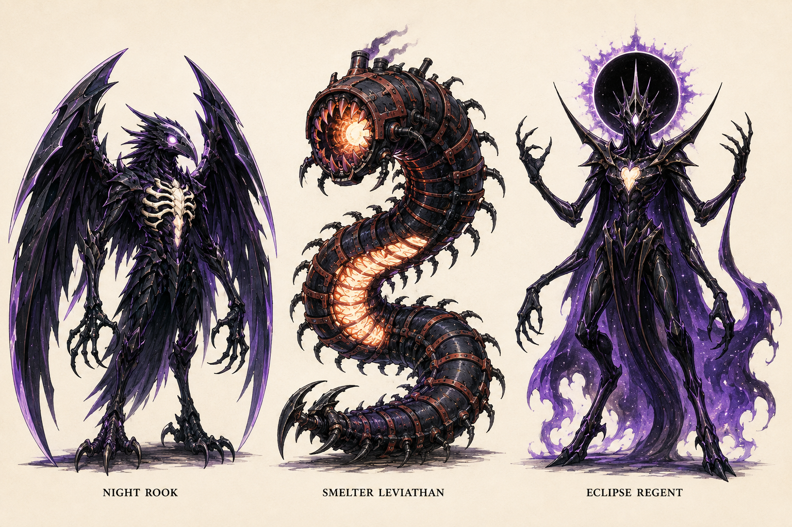

Night Rook resembles a skeletal raven made of folded night, with blade-shaped wings and an ivory sternum. The Smelter Leviathan is a many-segmented shadow centipede wearing stolen foundry rings around an orange-white furnace core. The Eclipse Regent is a crowned ring of black space above a long body with four arms and two legs, with a violet mantle and a small pale central heart.

Each boss needs a distinct silhouette, anatomy and exposed-core language. The Rook occupies roughly 3 Hopper heights with a 6 H wingspan; the Leviathan spans 8–10 H along the arena; the Regent stands 5 H tall. These are proposed gameplay sizes, separate from dramatic illustration composition.

Fear comes from patient anticipation, scale and strange movement. Their bodies dissolve into smoke and fractured light on defeat; the tone remains adventurous and avoids gore. Weak points use brightness and shape as well as color. Cosmetic smoke never hides a damaging edge or safe platform.

The lineup establishes candidate canonical designs. After approval, create separate side profiles and attack sheets for each boss using this plate as identity reference. Subsequent frames must retain the core, appendage count and signature silhouette.

<!-- page -->
## Boss encounter design

### Night Rook at the summit

A 3–4 minute encounter uses three broad mountain shelves, with lower recovery terrain. At full health, the Rook marks a dive corridor with a feather trail and sweeps past; jump, fire at its sternum, or stomp the back after the wings fold. A grounded feather-fan attack leaves a visible gap. At two-thirds health, it lands and channels through two wing joints; back-leg kicks break their guard. At one-third, shelves rise in a fixed sequence while the same attacks accelerate moderately.

Each major attack offers a 1.0–1.4 second warning and at least 1.2 seconds of punish time. The camera keeps the active shelves visible. A successful stomp opens the core for lasers; a kick interrupts a grounded channel. The fight ends with the transmitter revealed beneath its dissolving wings.

### Smelter Leviathan at the launch gantry

A 3–4 minute encounter spans two gantry tiers with safe side platforms. First, the boss sweeps its segmented tail across the lower deck after its rings light in order. Jump the sweep and kick the exposed tail joint. Next, a furnace breath fills one clearly marked lane; ascend or descend to the other tier and fire into the cooling mouth. Finally, the Leviathan coils around the elevator and exposes alternating upper and lower cores.

Stomping an exposed upper segment cracks its shell; lasers then reach the inner core. Machinery cycles pause during critical boss tells so hazards never combine into a forced hit. The body is not one continuous damaging rectangle: visible dangerous segments and safe occluded background sections are authored separately. Destroying the last core stops the launch engine and opens the star gate.

### Eclipse Regent in the gravity cathedral

A 4–5 minute final fight has three phases: heavy downward gravity, low downward gravity and alternating 0.85× floor/ceiling gravity. The arena contains broad mirrored shelves and a central open column. Phase one uses slow crawling shadow rings; leap them and kick the lowered hands to expose the heart. Phase two sends marked descending lances between floating shelves; use controlled stomps on summoned Veil Medusae to reach eye height. Phase three telegraphs each inversion with arrows and a 1.5-second count-in before attacks resume.

The Regent opens its heart after two successful mechanic interactions per cycle. Lasers shorten the punish phase, while a risky close kick deals a larger burst. Cap summoned foes at two, and remove residual projectiles during phase transitions. No hidden final health bar or unannounced instant-death attack. Defeat delivers a clear victory beat, a short illustrated return to Earth and credits with replay access.

<!-- page -->
## Enemy silhouette vocabulary

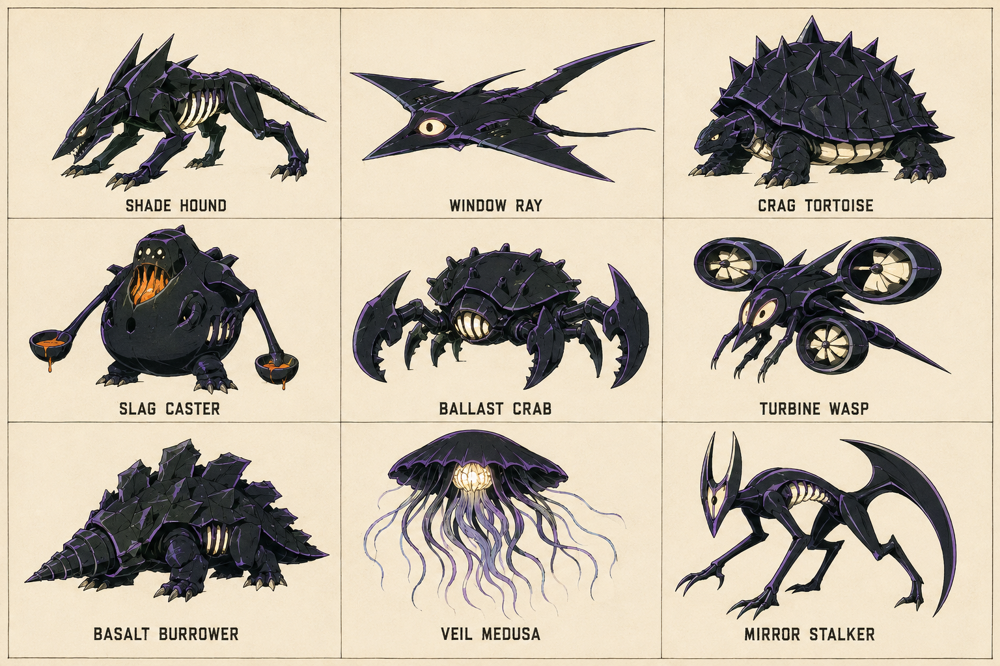

Use this sheet as the first reference for nine representative enemy families, one per environment. The second enemy in each area extends the area's language with a distinct silhouette and behavior; it must receive its own canonical sheet before animation. Enemies are not merely the same sprite recolored across levels.

A compact hound reads as pursuit; an open wing as a dive; a jagged shell as armor; a inflated furnace throat as a lob; an anchor body as a slam; a fan ring as a dash; a drilling snout as emergence; an umbrella as a pulse; and a forked crescent mask as a mirrored lunge. Keep these visual signals consistent with the encounter descriptions.

Animation budget per ordinary enemy begins with 6 locomotion or hover frames, 3 anticipation frames, 4 attack frames, 2 hit frames and 5 dissolve frames, adjusted to anatomy. Anticipation and active attack silhouettes must differ plainly. Bosses receive bespoke windups and recovery poses for every attack, not stretched ordinary-enemy cycles.

Before production, register each canonical enemy under a stable asset ID and save its prompt, reference lineage, palette and approved profile. Validate readability at actual on-screen size against its darkest and brightest environment. No enemy should require the concept sheet's printed label to be recognizable.

<!-- page -->
## Title identity and interface

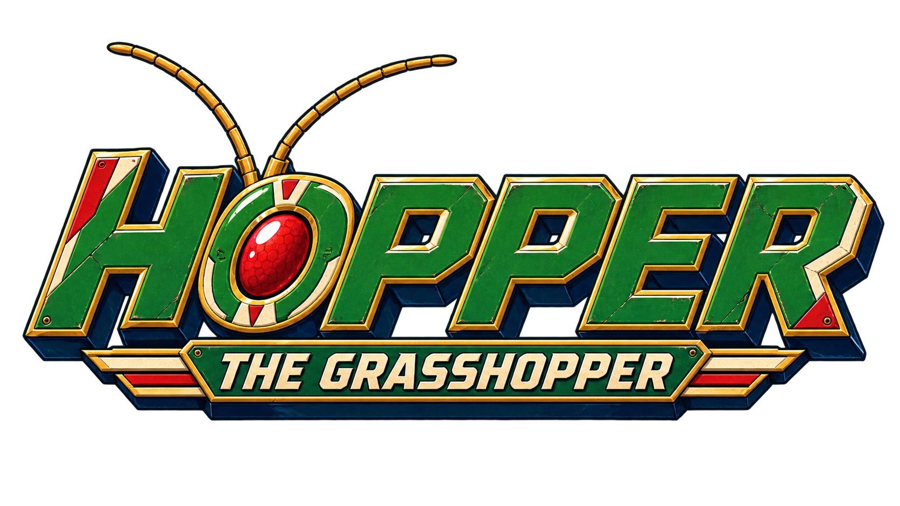

The logo uses broad slanted mechanical lettering and the hero's green, cream, red and gold palette. Preserve the exact title “Hopper the Grasshopper.” A separate simplified head emblem supplies the favicon, loading mark and app icon. Export small raster sizes only after checking the mark at 16, 32 and 48 pixels; the head must read without tiny lettering.

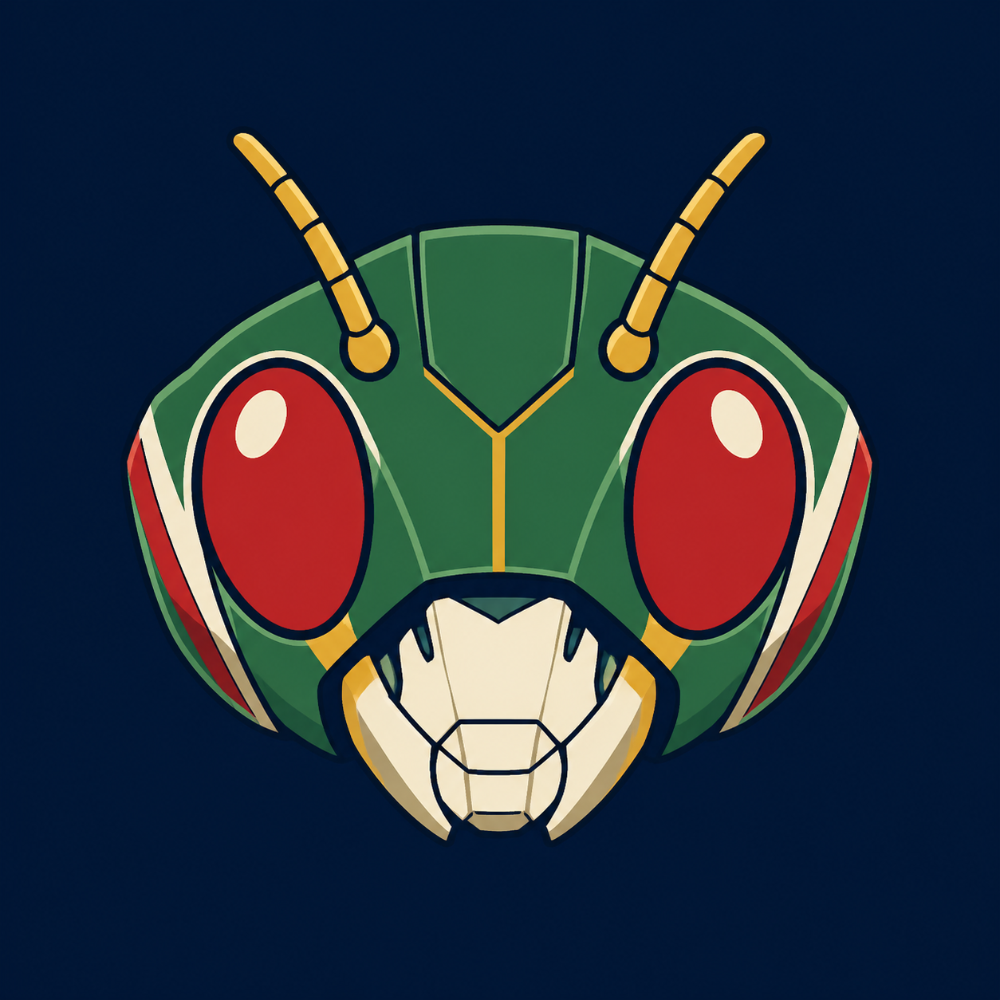

The title screen places the generated logo above a live accessible “Press Start” control over a painted landscape. Use subtle cloud and scarf motion, low background contrast behind text and an optional gentle theme. Instructions, Settings and Fullscreen icon buttons sit in the bottom right with visible controller focus and accessible labels. UI text remains live text, never baked into scenery.

Any fresh controller button starts from the idle title state. Moving the left stick enters utility navigation, as specified in the collection guidelines. In that mode A activates the focused control and B returns; a dialog consumes its inputs. Start requests fullscreen and enters the game, continuing gracefully if the browser rejects fullscreen. Consume that input to avoid an immediate jump or shot.

The HUD shows six armor pips at upper left, a compact laser heat gauge below, and a restrained area/checkpoint indicator. Boss health appears only during bosses. Keep the rider and next landing clear. A pause overlay contains Resume, Instructions, Settings, Restart Checkpoint and Return to Title; destructive choices require a controller-operable confirmation.

<!-- page -->
## Progression sound and accessibility

Start each checkpoint with six armor pips; normal hits cost one and heavy boss attacks cost two. Give 1.1 seconds of post-hit protection, visible through a soft outline rather than flashing invisibility. Knockback is short and capped near ledges. Recovery capsules restore two pips, and area transitions and boss entrances refill armor. No lives counter and no permanent upgrades are required to finish.

On defeat, show a brief recovery animation and restart the checkpoint within a target of three seconds after assets are loaded. Enemies and hazards reset deterministically. Save completed areas, collected keepsakes, settings and the current checkpoint locally. Continue resumes a safe checkpoint state, not a half-completed airborne collision. Boss progress resets on retry; defeated bosses remain cleared in campaign progress.

Each area has three optional signal fragments. They unlock illustration gallery entries and track exploration without affecting combat power. Mission results show completion time, fragments and damage taken. A rank is a replay incentive only. No time pressure on the first clear. Include a relaxed mode with longer telegraphs and reduced incoming damage, and standard mode as the intended baseline; neither changes core controls.

Audio should evoke a 1970s robot adventure with original melodic brass, strings, drums and analog electronics. Give eye lasers a sharp electronic transient, hind kicks a spring release plus metal sweep, and stomps a layered ground impact. Duck music briefly for boss telegraphs. Avoid a loud cue on every rapid laser pulse; alternate samples and limit simultaneous sounds.

Provide separate master, music and effects levels; vibration strength; screen shake; reduced motion; subtitle size; high-contrast threat outlines; optional landing guide; and dead-zone/sensitivity controls. Render text with readable sizing at 720p and support browser zoom for menus. Shape and animation accompany color cues. All mandatory prompts can be read without sound.

Pause on controller disconnection, window focus loss or hidden tab. Reconnection restores menu navigation and asks for an intentional resume. Support keyboard/pointer switching without discarding controller ownership accidentally. Single-player only for the first release. Touch gameplay and multiplayer are outside the proposed scope.

<!-- page -->
## Generated asset production plan

### Reference and export workflow

Keep the supplied inspiration unchanged. The approved Hopper profile becomes the root reference for every character pose, damage state and promotional scene. Use the approved boss lineup and individual enemy sheets as their respective roots. Record prompt, input reference paths, output filename, revision and acceptance notes in the asset manifest. Never generate a character sequence from a text description alone once its identity is approved.

Generate landscape paintings as separate sky, distant terrain, middle-distance architecture and near terrain layers, plus authored foreground platform pieces. The boards in this document are mood references, not directly tileable levels. Plan overlap and seams; inspect repeated textures and retain distinctive landmarks. Actual terrain art and collision surfaces must agree. Use texture-based rendering for characters, scenery and effects; procedural code is reserved for simulation, layout, collision, lighting modulation and UI, not substitute character or landscape art.

Generate transparent raster pose sequences and effect elements, inspect alpha edges and normalize registration into atlases. Aim initially for 512–768 pixel character frames, adjusting to the tested display size and memory budget. Keep master artwork; derive efficient delivery formats and pack per-area assets. Generate both necessary facings or approve clean mirroring of a reconciled design. Do not mirror labels, rider asymmetry or deliberately asymmetric damage blindly.

### Asset scope after approval

| Family | Initial production scope |
| --- | --- |
| Hopper and rider | One reconciled canonical model; about 58 core poses plus laser overlays |
| Ordinary enemies | 18 unique designs across 9 areas; about 20 poses each before reuse review |
| Bosses | 3 canonical turnarounds with bespoke attack sequences and phase effects |
| Environments | 9 sets of painted depth layers, platform pieces, hazards and landmarks |
| Effects | Laser pulses, eye glow, kick arcs, dust, sparks, core hits and dissolves |
| Interface and story | Logo, favicon/app mark, title art, controller diagram, portraits and 4 transition illustrations |

The generated reference plates delivered now demonstrate style and establish source identity. Final frame counts, atlas dimensions and download budgets are set after the first fully animated representative scene is profiled. Avoid loading the entire campaign's textures at once.

<!-- page -->
## Build sequence and review decisions

### Implementation sequence after design approval

1. Reconcile the canonical character and produce a short registered animation test containing run, variable jump, back-leg spin, eye fire and stomp. Review identity and motion at gameplay scale.
2. Build the title shell and a representative field-to-rooftop scene with Xbox gameplay and menus, using real generated production sprites and painted terrain. Tune jumps, camera, collision and attack direction together.
3. Finish Earthbound Thunder and the Night Rook. Verify area duration, checkpoints, changing elevation and the full mission loop before scaling the campaign.
4. Build the three industrial areas and Leviathan, then prototype gravity in a contained room before authoring the alien routes and Regent.
5. Complete audio, transitions, settings, save/replay behavior and accessibility. Profile load times and texture use; run the full campaign on the agreed browser and controller matrix.

Quality targets are smooth 60 fps on the agreed baseline machine, immediate visible input response, no tunneling during fast travel, correctly registered sprite attacks, and no required leaps beyond tested reach. Check actual wired or Bluetooth Xbox hardware as well as simulated inputs. Browser verification must cover rejected fullscreen, controller reconnect, keyboard switching, resized windows and pause/resume during every gravity mode. Report tested combinations rather than assuming universal browser behavior.

### Decisions for this review

Please review the green-and-red Hopper model and rider proportions; the 1970s cel character versus gouache landscape treatment; the nine atmosphere panels; the three boss silhouettes; the logo and small head mark; and the proposed 60–72 minute campaign length.

The key gameplay choices to approve or revise are the three-position attack system, laser heat, generous air steering, stomp rebound, checkpoint forgiveness, and the fixed-horizon gravity inversion. These are proposals that can change before implementation. A particular environment, enemy or boss can be revised without replacing the entire campaign.

All numerical values are starting points for a later playtest. This delivery contains the design document, generated concept and identity assets, and reproducible document sources. It does not contain a game build. The next development stage waits for your review of the artistic style and gameplay ideas.
