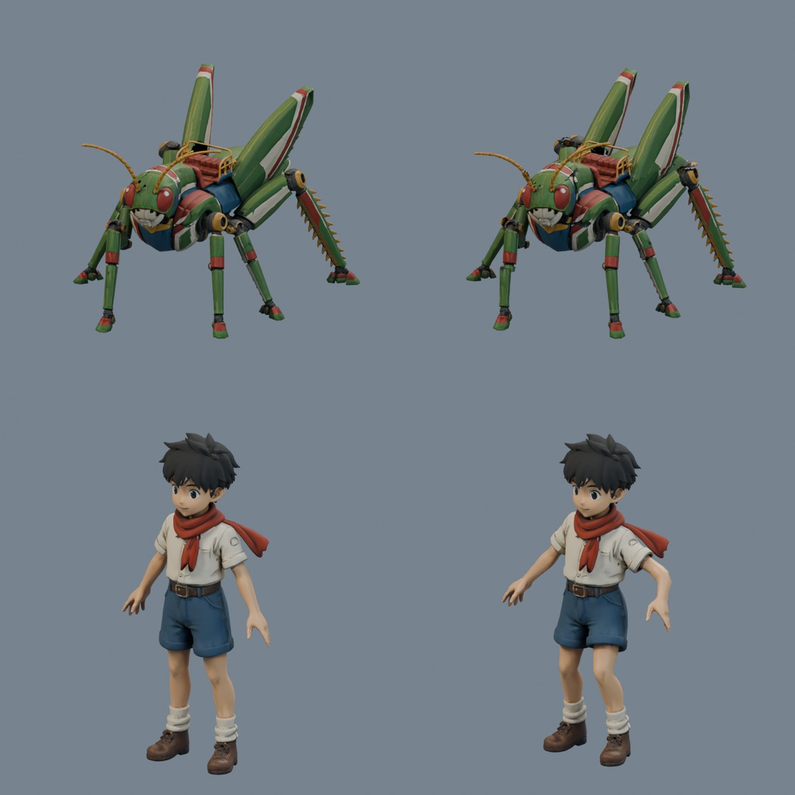
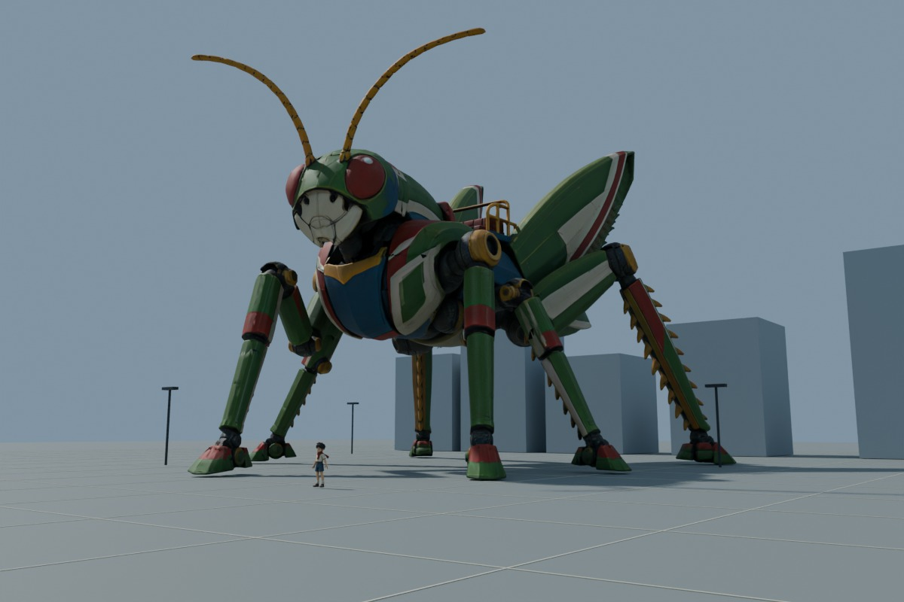

# Hopper and rider — processed 3D models

> **Animation update:** The current `output/` models now include gameplay clips and attachment sockets, plus a combined riding model. See [animation delivery](animation/README.md). The zero-animation counts below describe the preserved earlier static processing pass.

Completed September 7, 2026. Outputs are local, not published or integrated into the 2D game. Original Tripo assets remain untouched. No additional Tripo calls were used for this processing pass.

## Final game assets

| Model | Triangles | Bones | Max influences | Exact bytes |
| --- | ---: | ---: | ---: | ---: |
| [hopper.glb](/Users/hoai/Documents/Games/mini/local/hopper-3d/models/output/hopper.glb) | 64,908 | 33 | 1 | 2,743,348 |
| [rider.glb](/Users/hoai/Documents/Games/mini/local/hopper-3d/models/output/rider.glb) | 30,000 | 33 | 4 | 2,243,692 |

Both compressed exports re-imported into Blender with one armature, one skinned mesh, complete weight coverage, embedded textures and UVs, and zero animation clips. Meshopt decoder support is required for optimized GLBs; uncompressed versions are retained. Named attachment nodes are preserved.

## Geometry and rigs

**Hopper:** Separated the tall source wing above its hinge and mirrored its actual geometry and UVs across X=0, reversing triangle winding for outward normals. Rebuilt the opposite rear leg from the matching source-side upper/lower/foot components, aligning the pair. Retained the original front/middle legs and fitted their differing rest positions. Separated rigid articulation regions and closed cut interiors with a dark mechanical material. The rig has 33 deform/attachment bones and 7 editor controls (40 total): body, abdomen, saddle, head, two wings, six three-link legs, three antenna links per side, rider seat and two laser sockets. The Blender master has six optional foot IK targets; their constraint influence defaults to zero for FK posing. Enable a lower-leg IK constraint to use its corresponding CTRL foot target. Rigged armor uses exactly one bone influence per vertex to avoid rubbery bending.

**Boy:** Preserved the approved hand geometry. Rotated the source to face -Y and fitted a basic humanoid Rigify rig to his existing A-pose. The control rig has 216 total bones, including 33 deform bones; hands/feet have IK and FK controls. The pipeline computed heat weights on a disposable 35k-face proxy and transferred them onto the untouched 78,910-triangle surface. We normalized transferred weights and limited the master/game mesh to four influences. There are hand controls rather than individual finger or facial controls.

## Cleanup and validation

- Before articulation, Hopper seam welding reduced 85,827 vertices to 73,105 and 26,274 boundary edges to zero, without changing 146,282 triangles. The mirrored wing and deliberate closed articulation parts bring the full rigged master to 165,081 triangles.
- Boy cleanup reduced 45,523 vertices to 39,451 and 12,260 seam boundary edges to zero, retaining 78,910 triangles. Both source cleanup passes ended with zero non-manifold edges, loose vertices and degenerate faces.
- The portable pipeline produced separate ~65k / 30k LODs. Three duplicate Hopper LOD faces were detected and removed after reduction; the accepted result is 64,908 triangles.
- Inspected front, side and three-quarter rest and test renders on both full masters and reduced meshes. Boy tests use actual IK mode; wings, antennae, head and all six legs were exercised for Hopper.
- Re-imported all four compressed master/game GLBs. Required bone names, embedded images, UVs, finite geometry, no unweighted vertices and <=4 influences passed. A per-edge rigid-motion check confirmed Hopper armor does not stretch within its assigned links.
- These are practical triangulated animation sources, not hand-retopologized quad meshes. The visual tests cover modest motion, not finished jump/kick/landing clips or every extreme pose. Large rotations can expose the original generated joint intersections and may need local joint-cap or corrective work during animation authoring.

## Why Hopper looked like a toy

The source used linked metallic/roughness textures and a full-strength normal map under close studio lighting. This combination created small, sharp reflections and exaggerated surface dents. It was also shown in an isolated orthographic preview with no familiar-size object or ground contact. Those presentation cues made size ambiguous.

The revised export uses a satin painted-metal finish (roughness 0.64, metallic 0.18, coat 0), reduced normal strength 0.28, and dark joint interiors (roughness 0.72). Color artwork is preserved. Some illustrated highlights and uneven surface relief remain in the source; a later de-lighted/repainted texture pass and selected armor-surface smoothing would further improve closeups. A new whole-body remesh was avoided because it would damage the UV artwork and small details.

The scale study uses approximately 30 metres of overall Hopper length and a 1.4-metre boy, a 1.7-metre camera height, no depth-of-field miniature blur, directional sunlight, four-metre lamps and five-metre paving intervals. The block buildings are scale references, not game assets. This demonstrates how lighting, framing and context change the impression of mass. Final GLBs use this metre scale. Blender authoring masters remain in the original compact coordinate scale; export_scaled.py applies 30x / 1.43x scale and ground offsets.

In-game, retain readable ground contact shadows, metre-consistent buildings/rider, restrained specular response and weighted takeoff/landing timing. A texture change alone cannot establish giant scale in an empty model viewer.

## Files

Heavy assets are all in Git-ignored `mini/local/hopper-3d/models/`. Final publishable copies live in its `output/` directory; all source, working and validation artifacts remain outside that output folder.

| Asset | File | Exact bytes |
| --- | --- | ---: |
| hopper | [hopper_orig.glb](/Users/hoai/Documents/Games/mini/local/hopper-3d/models/hopper_orig.glb) | 7,328,388 |
| hopper | [hopper_rigged.blend](/Users/hoai/Documents/Games/mini/local/hopper-3d/models/hopper_rigged.blend) | 8,666,597 |
| hopper | [hopper_rigged.glb](/Users/hoai/Documents/Games/mini/local/hopper-3d/models/hopper_rigged.glb) | 9,378,780 |
| hopper | [hopper_rigged_optimized.glb](/Users/hoai/Documents/Games/mini/local/hopper-3d/models/hopper_rigged_optimized.glb) | 3,331,224 |
| hopper | [hopper_game_lod0.blend](/Users/hoai/Documents/Games/mini/local/hopper-3d/models/hopper_game_lod0.blend) | 5,362,097 |
| hopper | [hopper_game_lod0.glb](/Users/hoai/Documents/Games/mini/local/hopper-3d/models/hopper_game_lod0.glb) | 4,970,368 |
| hopper | [hopper_game_lod0_optimized.glb](/Users/hoai/Documents/Games/mini/local/hopper-3d/models/hopper_game_lod0_optimized.glb) | 2,743,348 |
| rider | [rider_orig.glb](/Users/hoai/Documents/Games/mini/local/hopper-3d/models/rider_orig.glb) | 3,889,752 |
| rider | [rider_rigged.blend](/Users/hoai/Documents/Games/mini/local/hopper-3d/models/rider_rigged.blend) | 5,486,331 |
| rider | [rider_rigged.glb](/Users/hoai/Documents/Games/mini/local/hopper-3d/models/rider_rigged.glb) | 4,788,556 |
| rider | [rider_rigged_optimized.glb](/Users/hoai/Documents/Games/mini/local/hopper-3d/models/rider_rigged_optimized.glb) | 2,587,244 |
| rider | [rider_game_lod0.blend](/Users/hoai/Documents/Games/mini/local/hopper-3d/models/rider_game_lod0.blend) | 3,444,407 |
| rider | [rider_game_lod0.glb](/Users/hoai/Documents/Games/mini/local/hopper-3d/models/rider_game_lod0.glb) | 3,132,380 |
| rider | [rider_game_lod0_optimized.glb](/Users/hoai/Documents/Games/mini/local/hopper-3d/models/rider_game_lod0_optimized.glb) | 2,243,692 |

[Export validation](/Users/hoai/Documents/Games/mini/local/hopper-3d/models/export-validation.json) · [Delivery hashes](/Users/hoai/Documents/Games/mini/local/hopper-3d/models/delivery-manifest.json) · [Hopper cleanup](/Users/hoai/Documents/Games/mini/local/hopper-3d/models/hopper_cleanup_report.json) · [Boy cleanup](/Users/hoai/Documents/Games/mini/local/hopper-3d/models/rider_cleanup_report.json)

## Reproducibility

Used the portable pipeline at `/Users/hoai/Documents/Stuff/Generations/portable-3d-model-pipeline-macOS-release`: conservative cleanup, fitted humanoid Rigify generation, proxy weight transfer, game LOD generation and deform-only export. Hopper uses asset-specific mechanical partitioning/rigging instead of the generic soft bone-heat freeform path. Added independent render/deformation/re-import checks. Meshopt compression uses the locally cached gltfpack with named nodes retained and high position/normal precision.

Asset-specific scripts and fitted rider configuration are preserved under `mini/local/hopper-3d/scripts/` and `configs/`. Rigify controls stay in .blend masters; portable game GLBs contain deform skeletons and no editor widgets or test animations. No existing pipeline files were modified.
